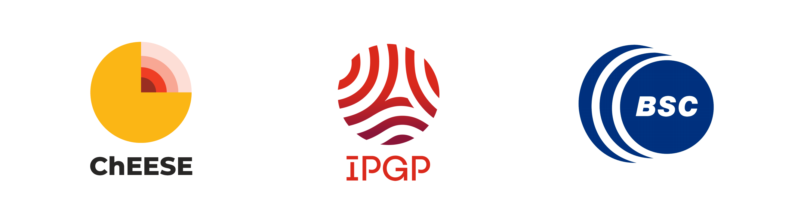

# Artificial Intelligence and Machine Learning for Geosciences 

> Material for the training course at the Barcelona Supercomputing Center, __5–7 November 2024__, delivered by:
> - Léonard Seydoux (Assistant Professor, IPGP)
> - Hugo Frezat (ChEESE postdoc, IPGP/CNRS)
> - Alexandre Fournier (Senior professor, IPGP)
> - Geneviève Moguilny (Research engineer, CNRS/IPGP).
>
> 
> 
> ChEESE is the [Center of Excellence for Exascale in Solid Earth](https://cheese-coe.eu/), a European project funded by the European Commission under the Horizon 2020 Research and Innovation program. The project aims to prepare European codes for the upcoming exascale supercomputers. The training is part of the ChEESE training program.
> IPGP is the [Institut de Physique du Globe de Paris](https://www.ipgp.fr/), a French research institution dedicated to the study of Earth and planetary sciences.
> BSC is the [Barcelona Supercomputing Center](https://www.bsc.es/), the Spanish national supercomputing center.

## Description

This training is aimed at geophysicists willing to develop an operational sense of AI, with a working knowledge of Python. Attendees with a lack of knowledge of Python will be provided with an upgrade notebook beforehand. Background in inverse problems, statistics or data assimilation is a plus. 

This repository contains the course material for the training, including the notebooks, the slides and the data. The material will be dropped in the repository as the course progresses (slides, notebooks, data, and solutions).

## Goals

The content of this course was partially taken from the master-level class _Earth Data Science_ of the institut de physique du globe de Paris taught by [Léonard Seydoux](https://sites.google.com/view/leonard-seydoux/accueil), [Alexandre Fournier](https://www.ipgp.fr/~fournier/), [Éléonore Stutzmann](https://www.ipgp.fr/~stutz/) and [Antoine Lucas](http://dralucas.geophysx.org/). 

The goal of this course is to introduce students to the basics of scientific computing and to the use of Python for solving geophysical problems. The course mostly consists in practical sessions where students will learn how to use Python to solve problems related to the Earth sciences mith statistical and machine learning methods. The course and notebooks rely on the Python [scikit-learn](https://scikit-learn.org/stable/) library, [pandas](https://pandas.pydata.org/), [pytorch](https://pytorch.org/), and the [deep learning](https://www.deeplearningbook.org/) book by Ian Goodfellow, Yoshua Bengio and Aaron Courville.

## Contents

> More information about the contents of the course will be provided as the course progresses. So far, the repository only contains the auto-evaluation notebook, that will allow you to check if you have the required level in Python to follow the course.

### Autovaluation

The first notebook is to be completed before the course as a check of your scientific Python usage. Check the [auto-evaluation notebook](./labs/0-self-evaluation.ipynb/self-evaluation.ipynb) and the [solutions](./labs/0-self-evaluation.ipynb/self-evaluation-answers.ipynb) if needed.