<!-- _class: titlepage-->

# Artificial Intelligence and Machine Learning for Geosciences

`Barcelona` `November 2024`

Léonard Seydoux, Hugo Frezat, Geneviève Moguilny & Alexandre Fournier

[`cheese-ai-for-geosciences`](https://github.com/leonard-seydoux/cheese-ai-for-geosciences)

 

---

<!-- paginate: true -->
## Goal: Learn about statistical inference and machine learning
1. __Identify__ data-related scientific problems
1. __Define__ the problem and design a solution
1. __Learn__ from examples in the litterature
1. __Criticize__ the litterature
1. __Train__ on real geoscience problems 

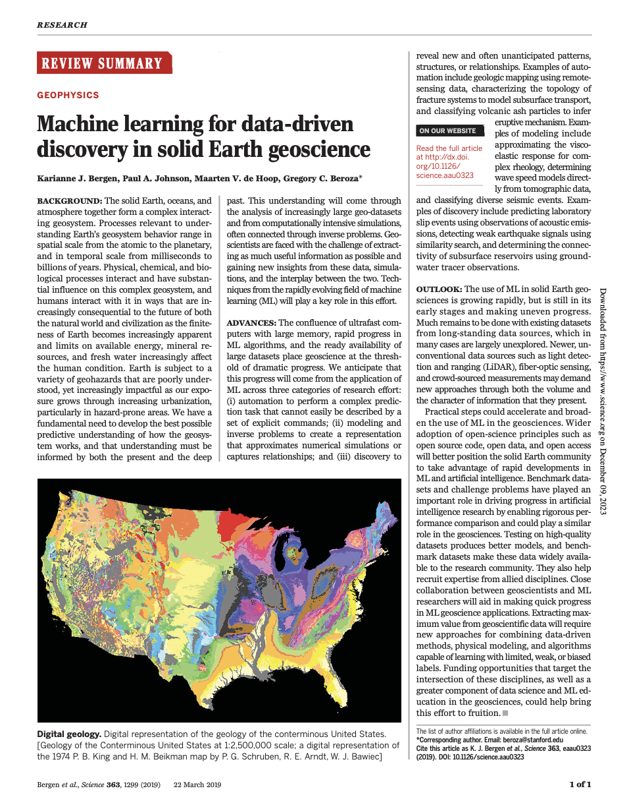
<!-- _footer: Bergen et al. (2019) -->

---

## Goal: Keep up with the ongoing pace
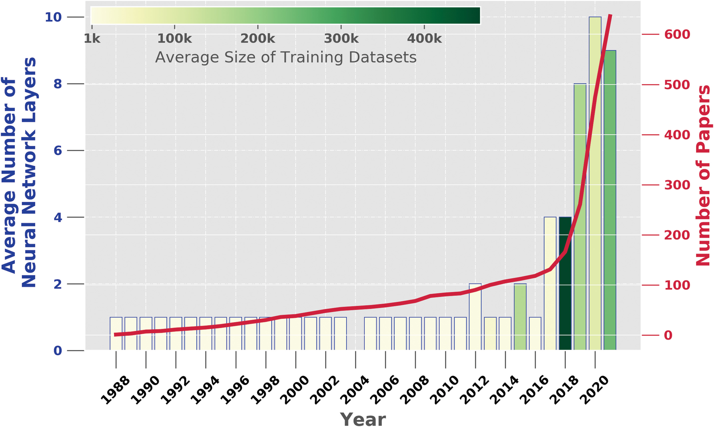
<!-- _footer: Mousavi et al. (2022) -->

---

## Contents of this class make use of the scikit-learn library

<!-- _footer:  [www.scikit-learn.org](https://scikit-learn.org/stable/) -->

---

## Contents of this class make use of the scikit-learn library
<iframe src="https://scikit-learn.org" width="1280px" height="500px" style="border:none; box-shadow: 0px 0px 20px #ccc;border-radius:15px;"></iframe>

<!-- _footer:  [www.scikit-learn.org](https://scikit-learn.org/stable/) -->

---

## Lots of resources are also taken from the _Deep learning_ book
- Very complete introduction 
- Historical aspects
- Starts from scratch (linear algebra)
- Covers machine/deep learning
- Illustrates with examples
- Online free access

<!-- _footer: www.deeplearningbook.org -->

---

<!-- _class: titlepage-->

# 1. Introduction

__Machine learning__ for Earth science: 
Why, what, and how? Are any of those methods useful for your research? How to read papers that use machine learning?

---
## How much time do you need to describe the following images?
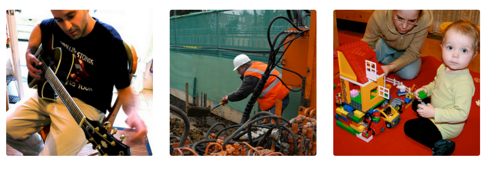
<!-- _footer: Karpathy & Fei-Fei (2015) -->
---
## How accurate are those descriptions?

<!-- _footer: Karpathy & Fei-Fei (2015) -->
---

## How do we extract such high-level knowledge from data?

- Identify objects within image
- Recognize objects category
- Understand the link between objects
- Sort links by priority
- Generate text out of it

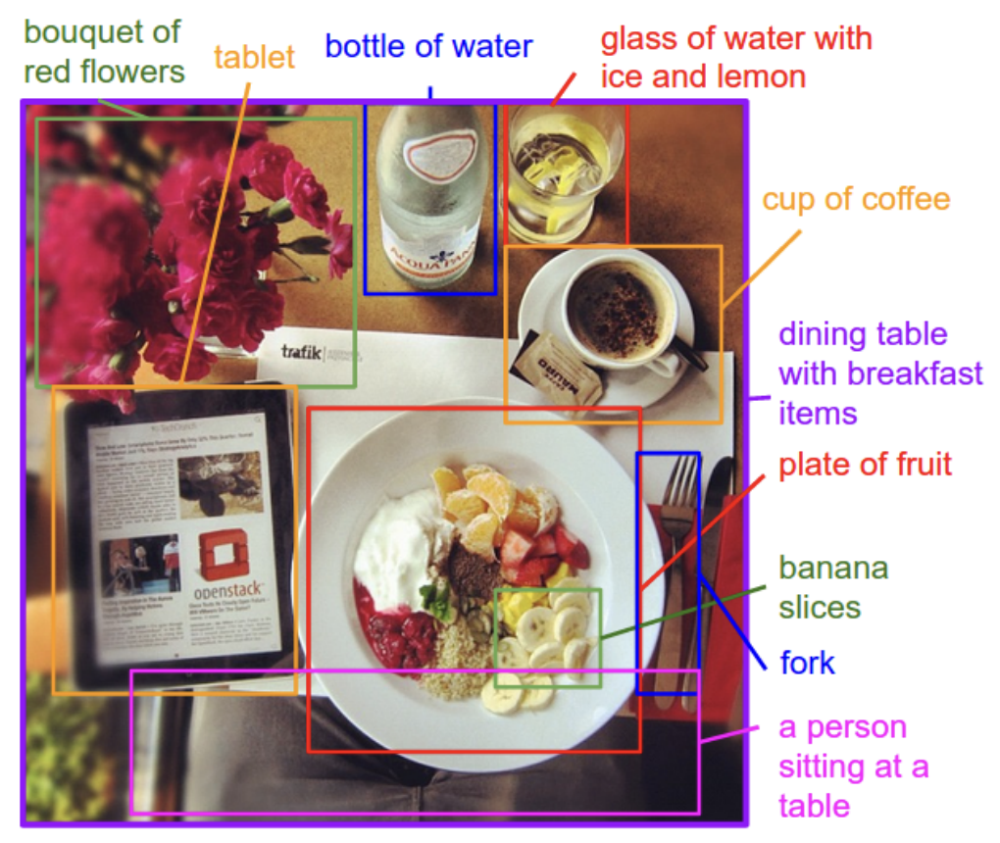
<!-- _footer: Karpathy & Fei-Fei (2015) -->

---

## Ingredients: hierarchical knowledge extraction
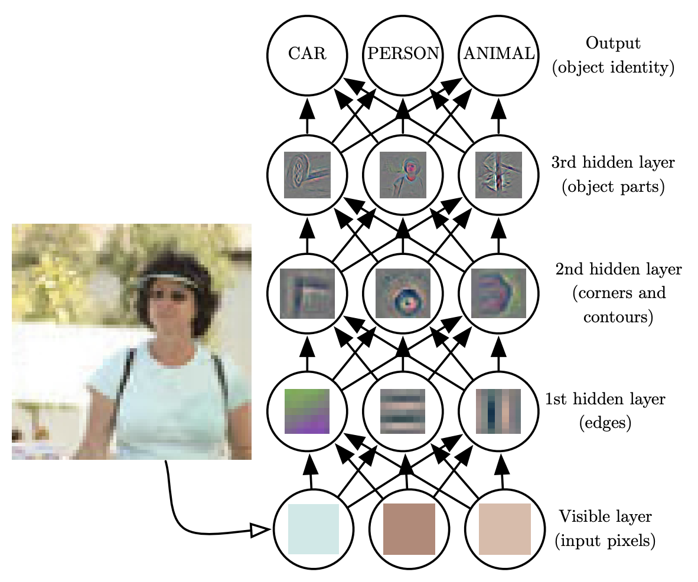
<!-- _footer: Goodfellow et al. (2016) -->

---

## Can you spot the seismogram?
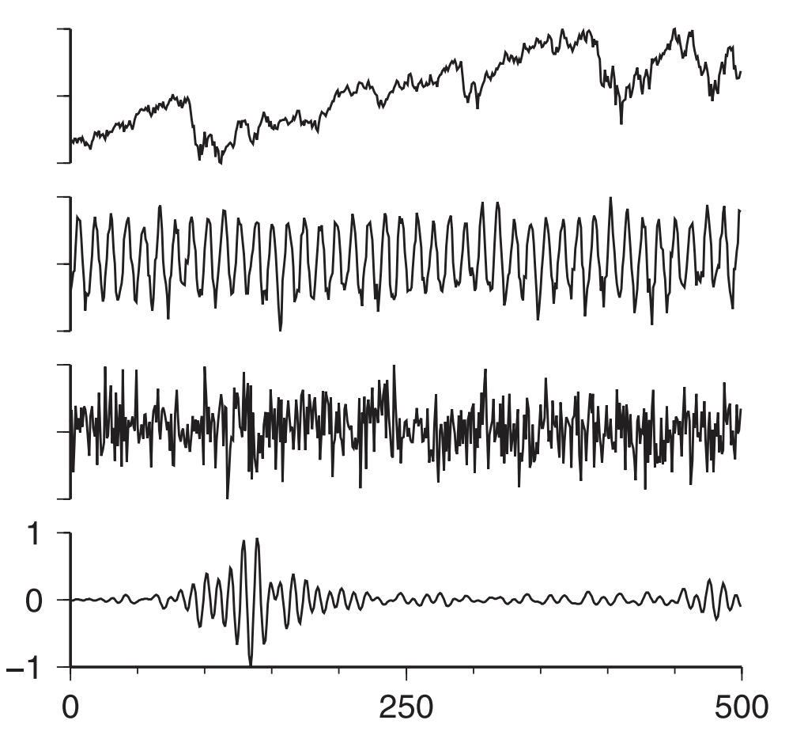

<!-- _footer: Valentine & Trampert (2012). Top to bottom: UK stock exchange; Temperature in Central England; Gaussian noise; Long-period seismogram.-->

---

## Detection and classification of events from seismograms

Most humans can pinpoint events. 

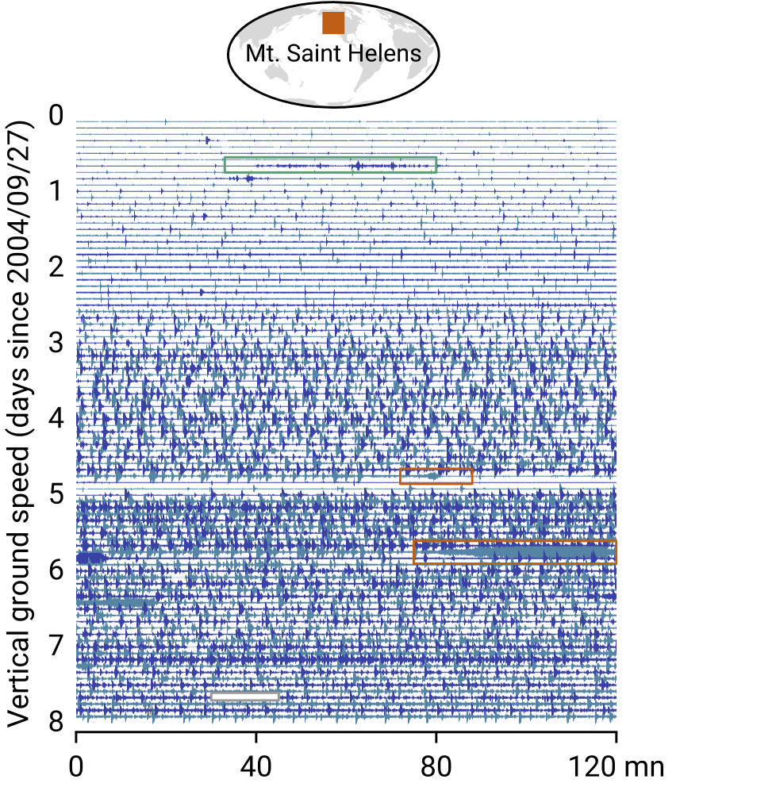

 

<!-- _footer: Moran et al. (2008) -->

---

## Detection and classification of events from seismograms

Most humans can pinpoint events. 

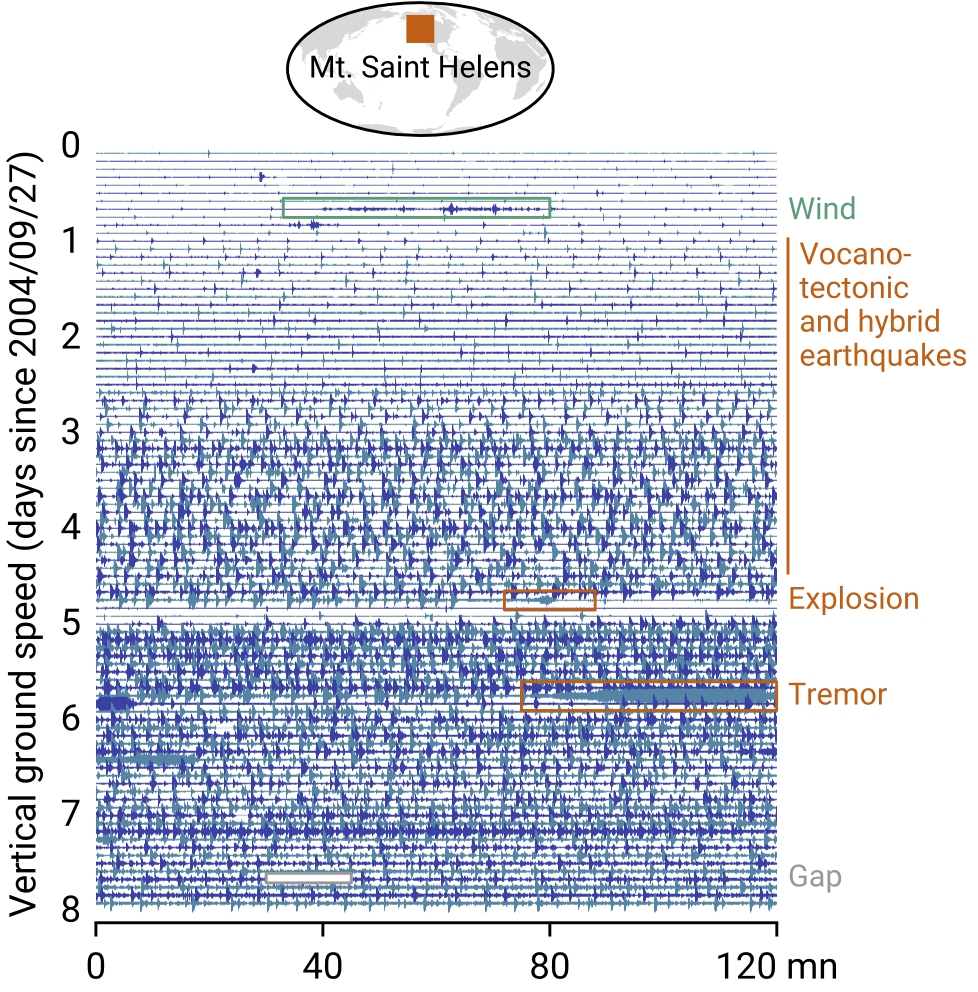

Experts can __classify__ them.

<!-- _footer: Moran et al. (2008) -->

---

## Diving into previously unseed data

Expert-detected marsquake within continuous insight data  
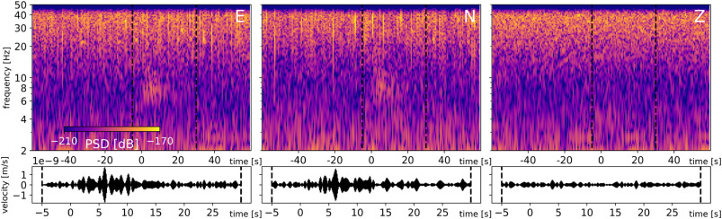

<!-- _footer: Clinton et al. (2021) -->
---

## Target tasks of machine learning

- Time-consuming tasks
- Hard-to-describe tasks
- Exploration of new data

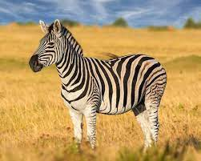

---

<!-- _class: titlepage-->

# 2. Definitions

__Machine learning__ is a field of study in artificial intelligence of statistical algorithms that can effectively generalize and thus perform tasks without explicit instructions. 

---

## General definition of machine learning

An algorithm learns from experience with respect to a task and performance, if its performance at solving the task improves with experience.

__All three elements are required.__

<svg viewBox="0 0 370 350" font-size="18px" text-anchor="middle" style="padding: 30px" font-family=var(--font)>
<circle cx="100" cy="100" r="100" fill=var(--color-magma) opacity="0.1"/>
<circle cx="260" cy="100" r="100" fill=var(--color-terra) opacity="0.1"/>
<circle cx="180" cy="240" r="100" fill=var(--color-olivine) opacity="0.1"/>
<text x="100" y="100" alignment-baseline="middle" fill=var(--color-magma)>Experience</text>
<text x="260" y="100" alignment-baseline="middle" fill=var(--color-terra)>Task</text>
<text x="180" y="240" alignment-baseline="middle" fill=var(--color-olivine)>Performance</text>
</svg>

---

## The data, the model, and the loss

🙊

__the data__ 

A set of samples $\mathbf{x}_i$ and labels $\mathbf{y}_i$ to learn from:

$$\mathcal{D} = \{(\mathbf{x}_i, \mathbf{y}_i)\}_{i=1}^N$$

---

## Useful vocabulary and symbols

| Symbol | Name |
|:-|:-|
|$\left\{ \mathbf{x}_i \in \mathbb{X} \right\}_{i =  1\ldots N}$| Collection of __samples__|
|$\left\{ \mathbf{y}_i \in \mathbb{Y} \right\}_{i =  1\ldots N}$| Collection of __labels__|
|$\mathbf{x}=(x_1, \ldots, x_F)$| Set of sample __features__|
|$\mathbf{y}=(y_1, \ldots, y_T)$| Set of label __targets__|
|$N$| Dataset size|
|$F$| Feature space dimensions|
|$T$| Target space dimension|
|$\mathbb{X}$| Data space|
|$\mathbb{Y}$| Label space|

An image is a sample $\bf x$ with 
$$\mathbf{x} \in \mathbb{X} = \mathbb{R}^{H \times W \times C}$$
$H$ is the height, $W$ the width, and $C$ the channels. The labels are a category $y$ with
$$y \in \mathbb{Y} = \{0, 1, \ldots, K\}$$
with $K$ the number of categories. 
Note that $y$ is scalar in this case.

---

## Main types of learning

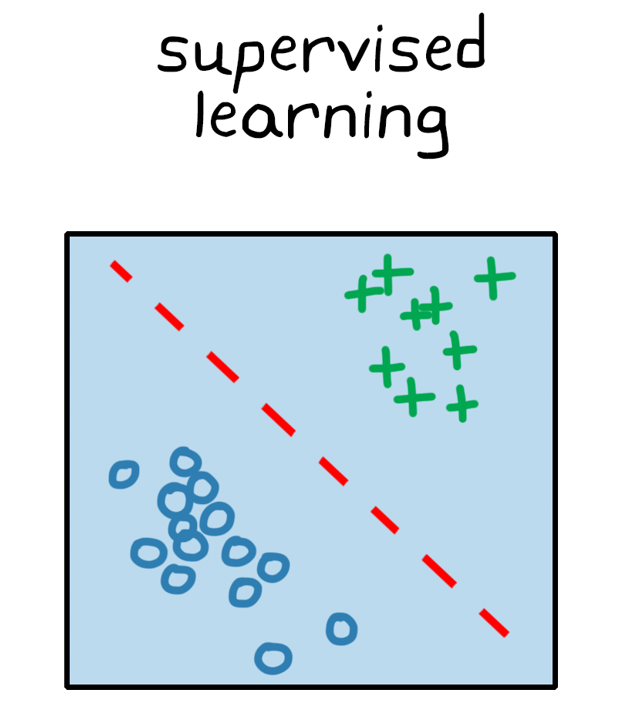

Predict $\mathbf{y}$ from $\mathbf{x}$ (regression, classification).

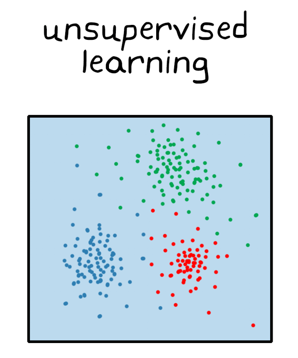

Learn some distribution $p(\mathbf{x})$ (clustering, reduction).

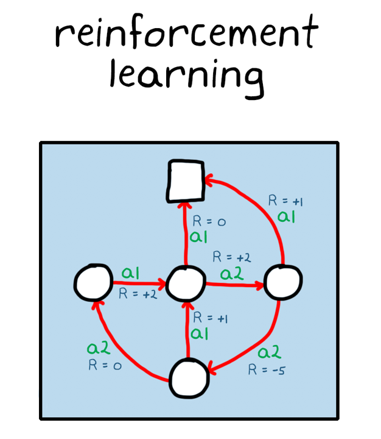

Learn a policy to maximize a reward (gaming, robotics).

<!-- _footer: from [mathworks.com](https://nl.mathworks.com/discovery/reinforcement-learning.html) -->

---

<!-- _class: titlepage-->

# 3. Regression

How to solve a regression or classification task with machine learning?

---

## The two main tasks of supervised learning

__Regression__
$x$ and $y$ are continuous

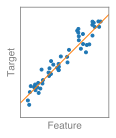

__Classification__
$x$ is continuous and $y$ is descrete 

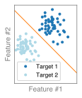

---

## The two main tasks of supervised learning

__Regression__
$x$ and $y$ are continuous

__Classification__
$x$ is continuous and $y$ is descrete 

--- 

## The regression task

__Dataset:__ set of $N$ samples $x_i$ and corresponding labels $y_i$ such as 

$$\mathcal{D} = \{(x_i, y_i)\}_{i=1}^N$$

__Regression:__ optimize the parameters $\theta$ of a function $f_\theta$ to predict $y$ from $x$. Find the optimal parameters $\theta^*$ that minimize $\mathcal{L}$, such as
$$\theta^* = \underset{\theta}{\arg\!\min }\mathcal{L}\Big(f_\theta(x), y\Big).$$

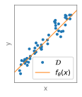

---

## The linear regression

__Linear model:__ coefficients $\theta = (a, b) \in \mathbb{R}^2$ that map $x$ to $y$ with 

$$f_\theta : x \mapsto y= ax + b.$$

__Loss function:__ mean squared error (example), given by 

$$\mathcal{L}(\theta) = \frac{1}{N} \sum_{i=1}^N \left( f_\theta(x_i) - y_i \right)^2.$$

__How do we minimize the loss?__

---

## Naive attempt: grid search

__Grid search:__ find $\theta^*$ among tested values of $\theta$. 

__Pros:__ easy to implement, exhaustive search, uncertainty estimation.

__Cons:__ unscalable. If 0.1s / evaluation, then 2 parameters with 100 values each takes 1/4 hour. _For 5 parameters it takes more than 30 years!_

__Any smarter idea?__

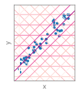

---

## Random search

__Random search__ to find $\theta^*$. 

__Pros:__ easy to implement, scalable, uncertainty estimation, can include prior knowledge.

__Cons:__ not exhaustive, can be slow to converge.

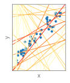

---

## Gradient descent

__Idea:__ estimate the gradient of $\mathcal{L}$ w.r.t. the parameters $\theta$, update the parameters towards gradient descent.

__Pros:__ converges faster than random search.

__Cons:__ gets stuck in local minima, slow to converge, needs differentiability.

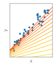

---

## Gradient descent

__Recipe__

1. Initial model $\theta = (a_0, b_0)$
1. Compute the gradient $\nabla \mathcal{L}(\theta)$
1. Update the model $\theta \leftarrow \theta - \eta \nabla \mathcal{L}(\theta)$
1. Repeat until convergence

__Hyperparameters__

The __learning rate__ $\eta$ is the update step.

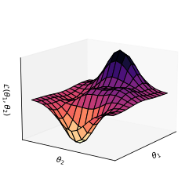

---

## How to deal with learning rate?
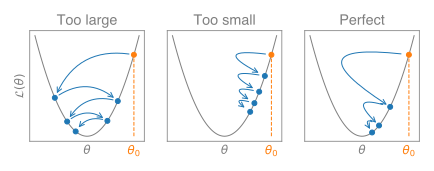
That's part of the __hyperparameters tuning__.
More about that in the deep learning lectures.

---

## The problem of overfitting
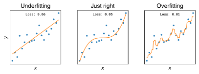
Having a loss close to 0 does not mean that the model __generalizes__ well.

---

## Key concepts to prevent overfitting: split the dataset
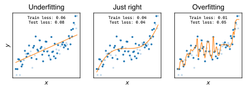
By splitting the dataset into a __training__ and a __testing__ set, 
we evaluate the performance on unseen (but __similar__) data. 

--- 

## Key concepts to prevent overfitting: regularization
Add a penalty term $\mathcal{R}$ to the loss $\mathcal{L_R} = \mathcal{L} + \lambda \mathcal{R}$, with $\lambda$ the regularization strength 
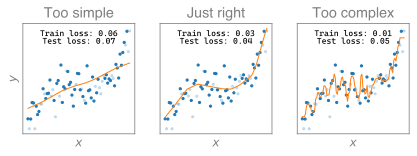
The regularization penalizes the model's complexity. 

---

## Why so many regression algorithms?

Because of combination of models, losses, and regularizations. The [scikit-learn.org](https://scikit-learn.org/stable/) website provides a unified interface in a `greybox style`.   The model selection is made by experience or __trial and error__.

<iframe src="https://scikit-learn.org/stable/supervised_learning.html#supervised-learning" width="500px" height="500px" style="border: none; box-shadow: 0px 0px 20px #ccc; border-radius: 10px;"></iframe>

<!-- _footer:  [www.scikit-learn.org](https://scikit-learn.org/stable/) -->

---

## Guidelines for exploring relevant models

<!-- _footer:  [www.scikit-learn.org](https://scikit-learn.org/stable/) -->

--- 

<!-- _footer: Jupyter $\\times$ Obsera -->

## Notebook: expansive data from cheap sensors

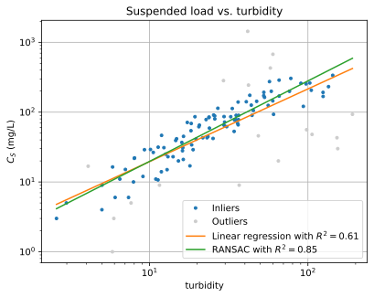 

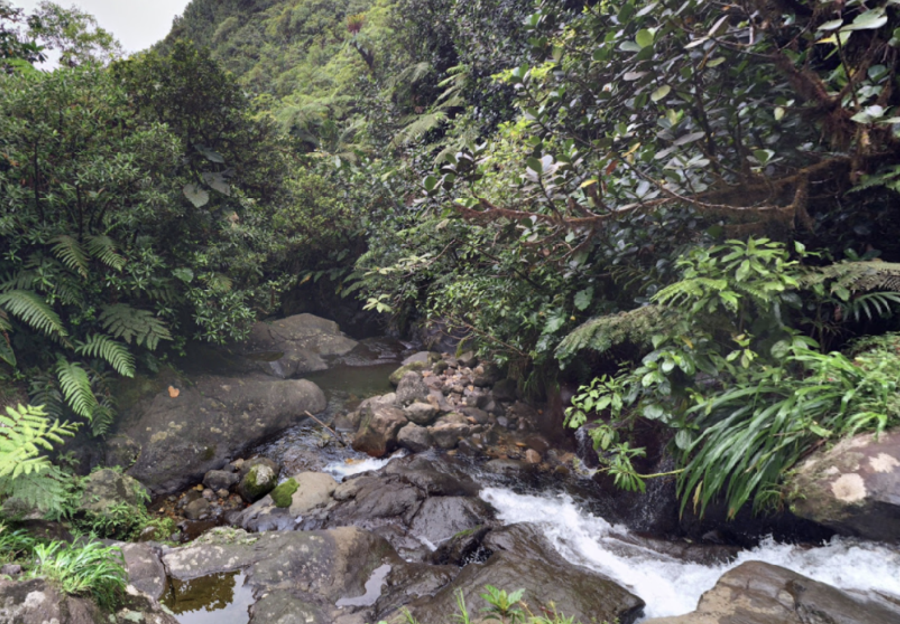  

---

<!-- _footer: Jupyter $\\times$ PhaseNet -->

## Find out _P_ and _S_ waves within continuous seismograms

How do you addess this regression problem? 
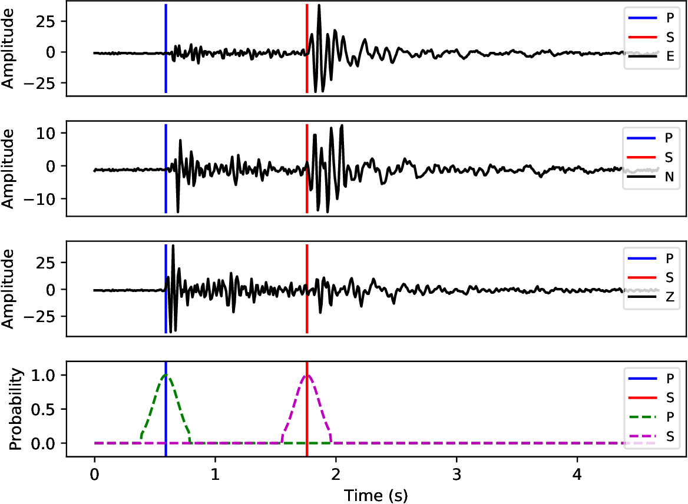

---

<!-- _class: titlepage-->

# 4. Supervised machine learning: classification

How to solve a regression or classification task with machine learning?

---

## The two main tasks of supervised machine learning

__Regression__
$x$ and $y$ are continuous

__Classification__
$x$ is continuous and $y$ is descrete 

---

<!-- _footer: www.scikit-learn.org -->

## The classification task

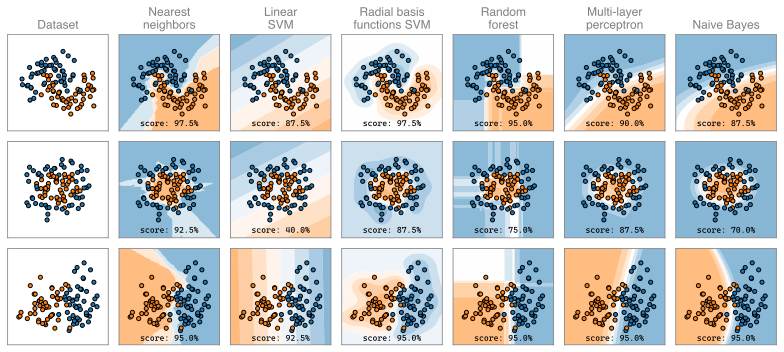

Here again, we have many possibilities.

---

## The classification task

__Experience__: labels $y \in \{0, 1\}$ for two features $\mathbf{x} \in \mathbb{R}^2$.

__Task__: predict $\hat{y}$ of each sample $\mathbf{x}$.

__Performance__: how should we measure the performance of a classifier?

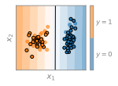

---

<!-- _footer: https://en.wikipedia.org/wiki/Support_vector_machine -->

## The classification task with support vector machines (SVM)

Support vector machines search the hyperplane of normal vector $\mathbf{w}$ and bias $b$ that split the classes.

> Note: in 2D, a hyperplane is a line.

The support vectors are the samples that are closest to the other class.

---

## The classification task with support vector machines (SVM)

The decision function $f(\mathbf{x})$ dependson  the sign of the linear combination of the normal vector and the sample:

$$f(\mathbf{x}) = \mathbf{w} \cdot \mathbf{x} + b$$

The quantity to minimize is the __Hinge loss__:

$$\mathcal{L}(\mathbf{w}, b) = \frac{1}{N} \sum_{i=1}^N \max\left(0, 1 - y_i \left(\mathbf{w} \cdot \mathbf{x}_i + b\right)\right)$$

 

---

## The classification task with support vector machines (SVM)

The decision function $f(\mathbf{x})$ depends on the sign of the linear combination of the normal vector and the sample:

$$f(\mathbf{x}) = \mathbf{w} \cdot \mathbf{x} + b$$

The quantity to minimize is the __hinge loss__:

$$\mathcal{L}(\mathbf{w}, b) = \frac{1}{N} \sum_{i=1}^N \max\left(0, 1 - y_i \left(\mathbf{w} \cdot \mathbf{x}_i + b\right)\right)$$

__What about non linear problems?__

--- 

<!-- _footer: www.medium.com -->

## The kernel trick for non linear classification problems

The kernel trick allows to map the data to a __higher dimensional__ space
made from the input features where the problem is __linearly separable__.  

The __Radial Basis Functions__ (RBF) is an infinite kernel $K(\mathbf{x}, \mathbf{x}') = \exp\left(-\frac{\|\mathbf{x} - \mathbf{x}'\|^2}{2\sigma^2}\right)$

---

## Generalization of the SVM: the support vector classifier (SVC)

The SVC is a generalization of the SVM that digests more than two classes.   
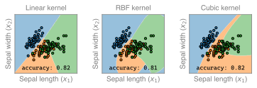
The decision function is linear in the kernel space only. 
We can project it back to the data space to inspect it.

---

## Various classifcation metrics from the confusion matrix

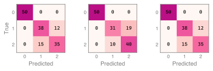

---

## Various classifcation metrics: accuracy, precision, recall

<!-- _footer: Ma et al. (2019) -->

---

## Decision trees and random forests

__Decision trees__ learn to predict $y$ with feature splitting.

__Random forests__ are ensembles of decision trees that vote for $y$.

__These algorithms are extremely powerful.__

<!-- _footer: from [scikit-learn.org](https://scikit-learn.org/stable/auto_examples/tree/plot_iris_dtc.html) -->

---

## Representation matters!

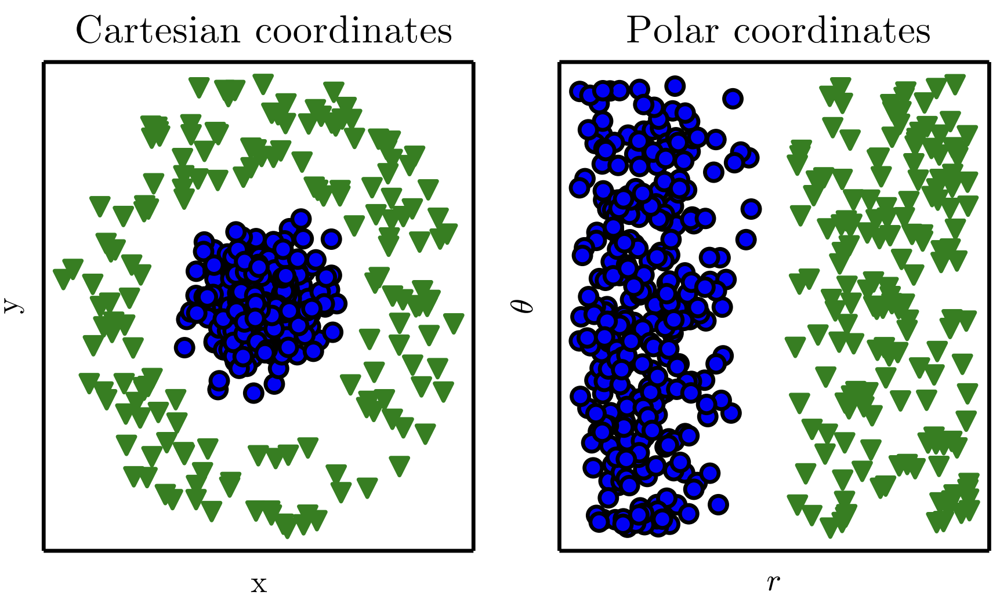
There is no need for a complex model if you have a good __representation__ of the data.

---

## Learning strategies depending on the task complexity

Hand-designed or learned features?

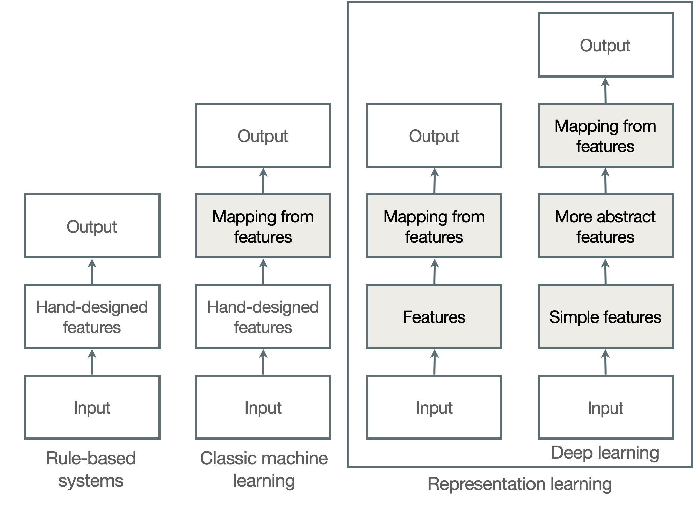

<!-- _footer: Goodfellow et al. (2016) -->

---

<!-- _footer: still from Valentine & Trampert (2012) -->

## Why would waveforms not be the best representation of ground motion?

We can see waveforms $\mathbf{x}\in\mathbb{R}^N$ as points of a $N$-dimensional space 

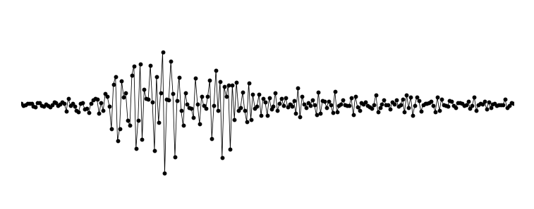

Yet, seismic waveform do not occupy this space fully, likely very sparse.

__Dimension > Information__

---

## Actually, natural data spaces may be often not fully occupied

Random sampling of the pixels of a face. What is the likelihood that the reshuffled image _is_ a face?

 

 

Like waveforms, __images are living on a manifold.__

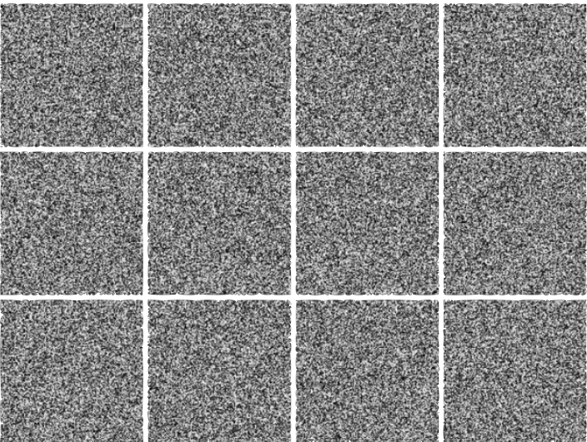

<!-- _footer: modified from Goodfellow et al. (2016) -->

---

## Supervised learning for sismo-volcanic signal classification

__Supervised learning__ experiences a set of examples containing features $\mathbf{x}_i \in \mathbb{X}$ associated with labels $\mathbf{y} \in \mathbb{Y}$ to be predicted from the features (here, classification).  
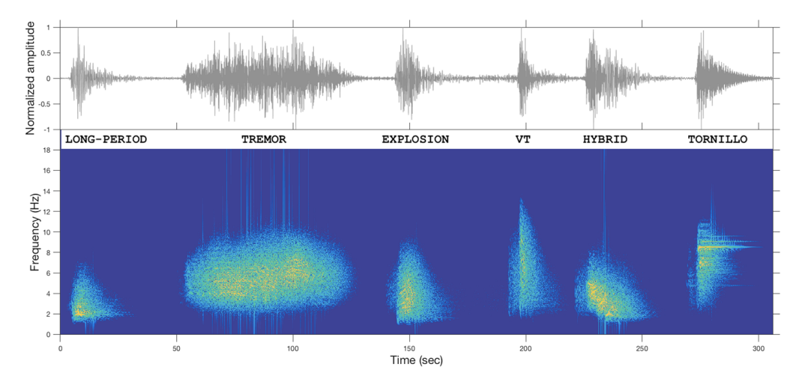

<!-- _footer: Malfante et al. (2018) -->
---

## Supervised learning for sismo-volcanic signal classification

In this case, $\mathbf{x}$ lies in $\mathbb{R}^{3 \times N}$, and $\mathbf{y}$ in $[0, \ldots, 5]$. 
Which __representation__ of $\mathbf{x}$ works best?

<!-- _footer: Malfante et al. (2018) -->

---

## Handcrafted features for classical machine learning

We need to find relevant descriptors of our data, used as features $\mathbf{x}$.
 

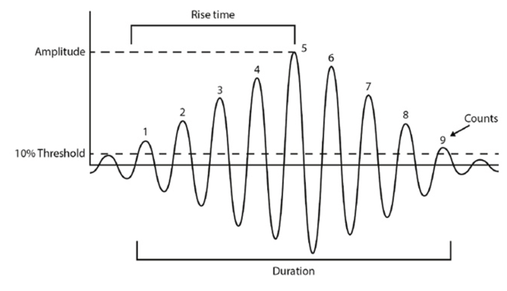

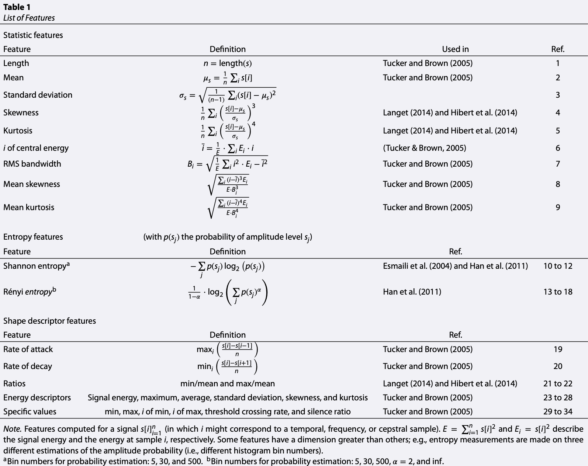

<!-- _footer: Jasperson et al. (2022) -->

---

## Performance measure, and what can we learn from it?
Accuracy of the predictions measures the model's performance (= confusion matrix)    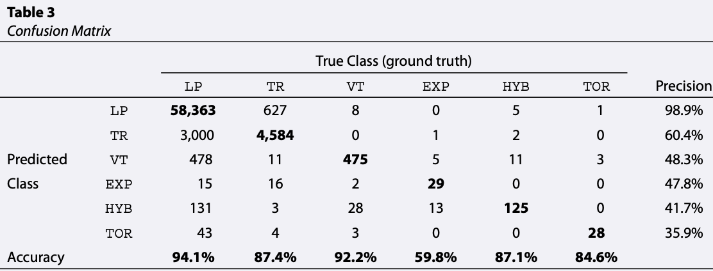 
What is the guarantee that the features we choose are the best ones?

<!-- _footer: Malafante et al. (2018) -->

---

## Notebook: Lidar point cloud classification

__Problem:__ automate the identification of objects in a lidar cloud from labeled subset.

__Objectives:__ supervised learning, classification, non-linear models, multi-scale features.

---

<!-- _class: titlepage-->

# 5. Deep learning: multi-layer perceptrons

How deep learning works? What is a neural network? How to train it, and what for?

---

## A general form of an artificial neuron

A __neuron__, or unit, takes a set of inputs $\bf x$ and outputs an activation value $h$, as
$$
h = \varphi\left(\sum_{i=1}^{N} w_i x_i + b \right)
$$
with $w_i$ the weights, $b$ the bias, $\varphi$ is the activation function, and $N$ is the number of inputs.

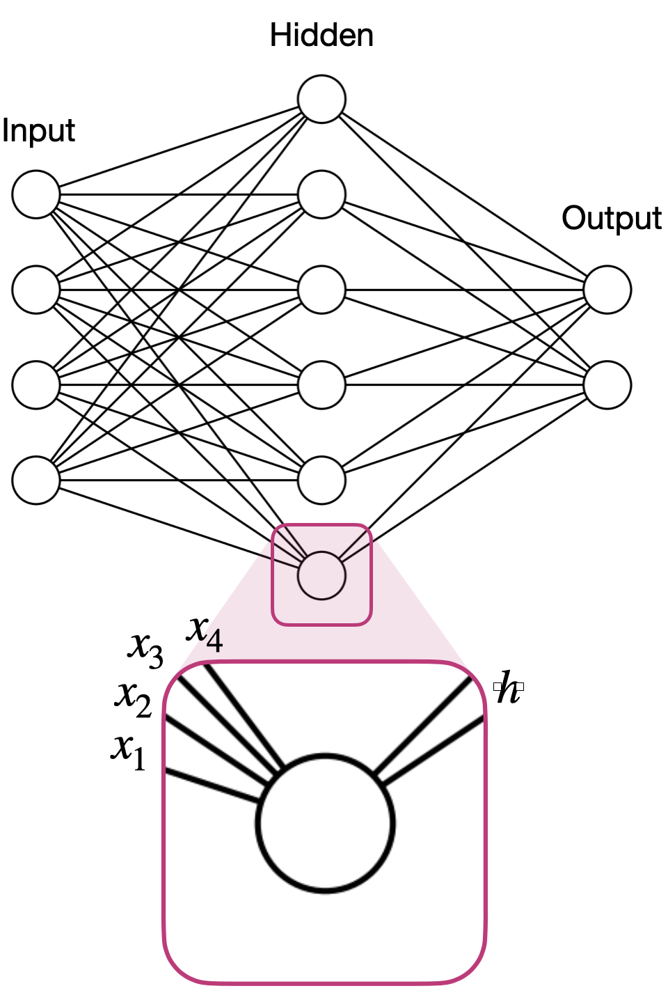

---

## A famous neuron: the sigmoid unit

A __neuron__, or unit, transforms a set of inputs $\bf x$ into an output $h$, as
$$
h = \varphi\left(\sum_{i=1}^{N} w_i x_i + b \right)
$$
with $w_i$ the weights, $b$ the bias, $\varphi$ is the activation function, and $N$ is the number of inputs. Common activation functions include the __sigmoid__ function, defined as
$$
\varphi(z) = \frac{1}{1 + e^{-z}}
$$

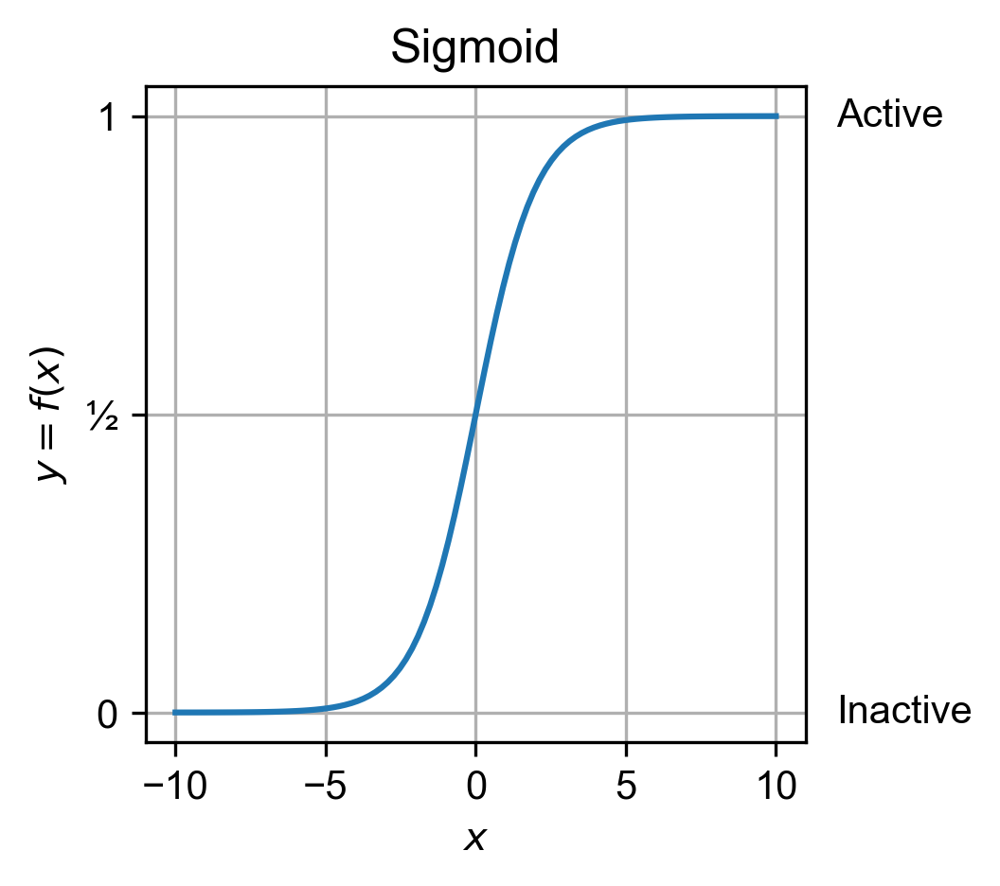

---

## An even more famous one: the rectified linear unit

A __neuron__, or unit, transforms a set of inputs $\bf x$ into an output $h$, as

$$
h = \varphi\left(\sum_{i=1}^{N} w_i x_i + b \right)
$$

with $w_i$ the weights, $b$ the bias, $\varphi$ is the activation function, and $N$ is the number of inputs. Common activation functions include the __rectified linear unit__ (ReLU), defined as

$$
\varphi(z) = \max(0, z)
$$

<!-- _footer: ReLU are empirically preferred to sigmoid units for  computational efficiency no saturation when $x$ is large.-->

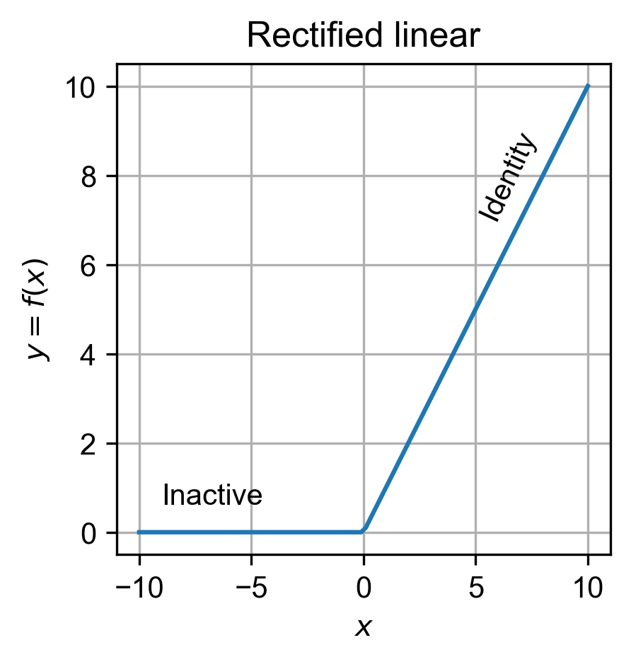

---

## The multilayer perceptron (MLP)

A __multilayer perceptron__ is a neural network with multiple hidden layers:
$$
\begin{align*}
h_i^{(1)} &= \varphi^{(1)}\left(\sum_j w_{ij}^{(1)}x_j + b_i^{(1)}\right)\\
h_i^{(2)} &= \varphi^{(2)}\left(\sum_j w_{ij}^{(2)}h_j^{(1)} + b_i^{(2)}\right)\\
y_i &= \varphi^{(3)}\left(\sum_j w_{ij}^{(3)}h_j^{(2)} + b_i^{(3)}\right)
\end{align*}
$$

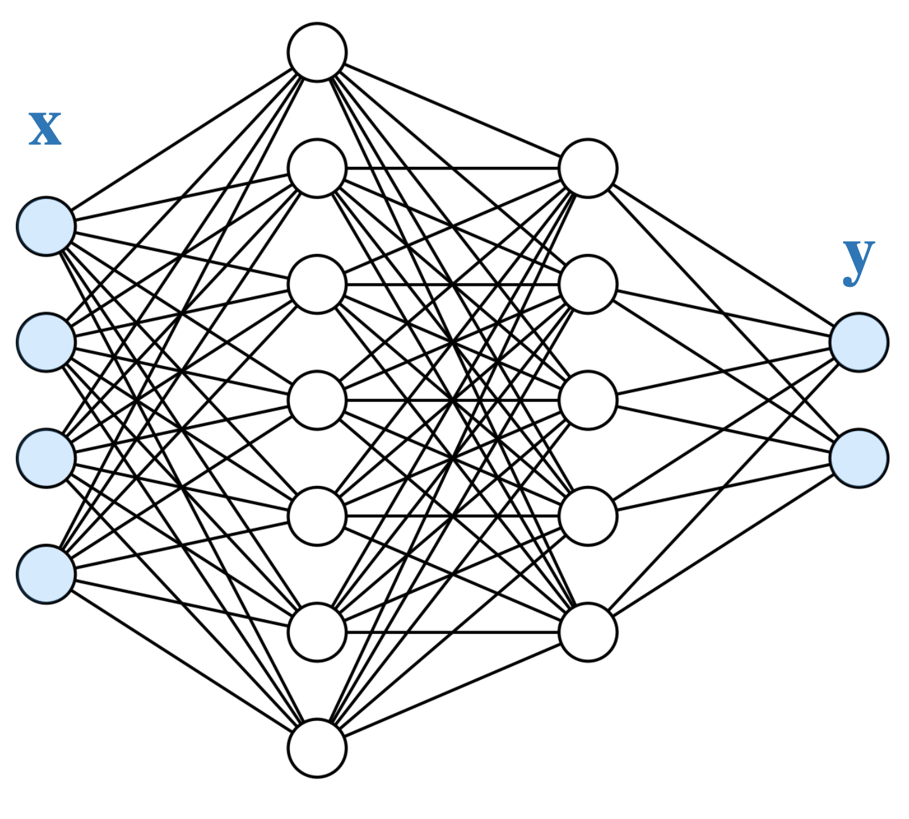

---

## The multilayer perceptron (MLP)

A __multilayer perceptron__ is a neural network with multiple hidden layers. Generally speaking (omitting the biases):
$$
y = \varphi^{(\ell)}\left(\mathbf{W}^{(\ell)}\varphi^{(\ell - 1)}\left(\mathbf{W}^{(\ell - 1)} \ldots \varphi^{(1)}\left(\mathbf{W}^{(1)}\mathbf{x}\right) \ldots \right)\right)
$$

---

## Quick example for solving the XOR problem

Multi-layer perceptrons that solves the XOR problem with binary activations:

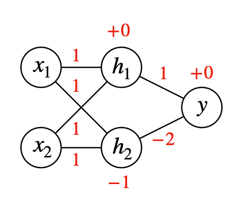

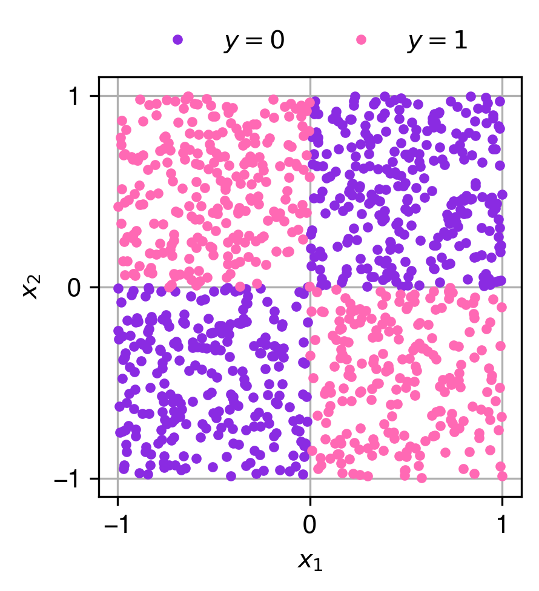

<!-- _footer: See Section 6.1 of Goodfellow et al. (2016) -->

---

## Gradient descent for neural networks

We note $f_\theta(x): x \mapsto y$ the model, where $\theta$ are the parameters of the model (including biases and weights).

1. __Learning__ is the process of finding the parameters $\theta^*$ that minimize the loss $\mathcal{L}$.

2. The __backpropagation__ computes the loss function gradient with respect to $\theta$.

3. The __gradient descent__ updates $\theta$ in the direction of the steepest descent.

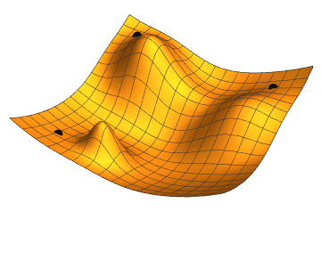

---

## Gradient computation with backpropagation

1. __Initialization__: the weights are initialized randomly, the biases to zero
2. __Feed forward__: the input is propagated through the network to compute the output
3. __Loss__: the loss is computed between the output and the target
4. __Back propagation__: computation of the gradient from the loss to the input
5. __Gradient descent__: update the parameters in the direction of the steepest descent

---

## Gradient-based optimization

Once the gradient is computed, the parameters are updated using the __gradient descent__ algorithm:

$$
\begin{align*}\\
\theta &\leftarrow \theta - \eta \frac{\partial \mathcal L}{\partial \theta}
\end{align*}
$$

where is $\eta$ the __learning rate__ that controls the size of the update.

---

## Gradient descent common issues

- __Local minima__: getting stuck in a local minimum.

- __Sattling points__: behaves as a local minimum but is not.

- __Plateau__: flat loss function, vanishing gradient, slow convergence.

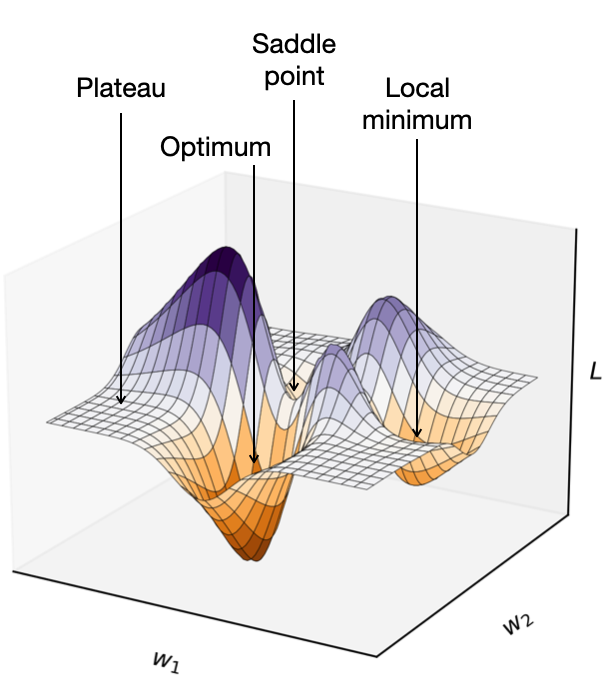

---

## Gradient descent common issues with plateau

__Plateau__ are flat regions of the loss function where the gradient is zero. This can happen with activation functions such as the sigmoid function with saturation. It can also happen with the ReLU function for inputs with negative values.

---

## Gradient-descent tricks to avoid issue

- __Learning rate__: set up, and maybe adapt it. 
- __Momentum__: use the gradient of the previous iteration to update the parameters.
- __Normalization__: normalize the inputs of each layer.
- __Stochastic gradient descent__: use a mini-batch of samples to compute the gradient.
- __Dropout__: randomly drop some neurons during training.

---

## Gradient descent and learning rate

The __learning rate__ is a hyperparameter that controls the size of the update of the parameters:

$$
\theta \leftarrow \theta - \eta \cfrac{\partial \mathcal L}{\partial \theta}
$$

We must look for a learning rate to avoid local minima while still converging fast enough, without diverging.

> We can also __adapt__ the learning rate.

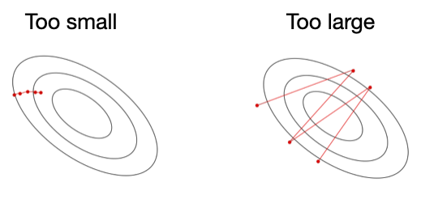

---

## Gradient descent and momentum

The __momentum__ is a technique to accelerate the gradient descent by adding a fraction of the gradient of the previous iteration:
$$
\begin{align*}
p &\leftarrow \alpha p - \eta \frac{\partial \mathcal L}{\partial \theta}\\
\theta &\leftarrow \theta + p
\end{align*}
$$
where $\alpha$ is the a damping parameter, and $v_i$ is the __velocity__. Lower values of $\alpha$ give more weight to the current gradient, higher values give more weight to the previous gradients.

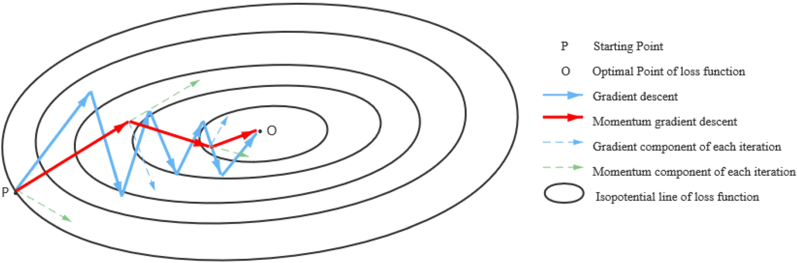

<!-- _footer: From Zhang et al. (2021) -->

---

## Data normalization

---

## Monitor the training curves

The __training curves__ are a good way to monitor the training of a model.

- Slow: increase the learning rate.
- Growing: decrease the learning rate.
- Cross-validation: within 0.0001 to 0.1

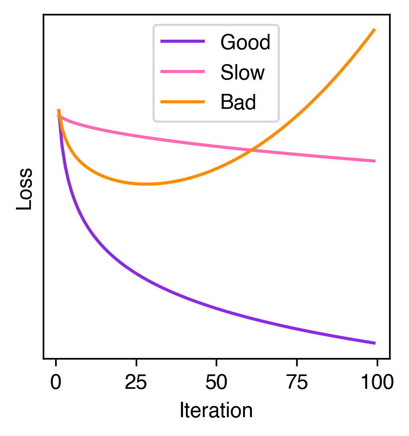

---

## Stochastic gradient descent

The gradient of the loss function with respect to the parameters $\theta$ is computed using the __full-batch gradient descent__ equal to:

$$
\frac{\partial \mathcal L}{\partial \theta} = \frac{1}{N} \sum_{i=1}^N \frac{\partial \mathcal L^{(i)}}{\partial \theta}\\
$$

The __stochastic gradient descent__ is a technique to compute the loss gradient from every sample in the dataset at each iteration.

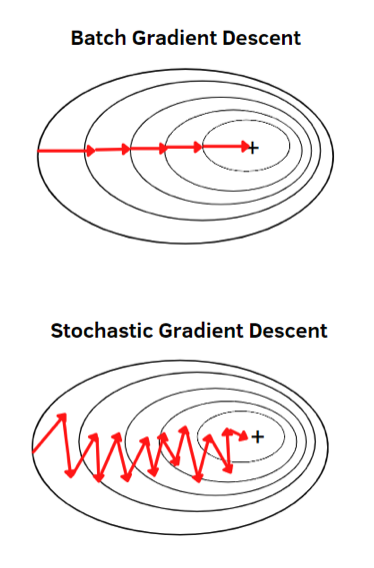

---

## Mini-batch gradient descent

The __mini-batch gradient descent__ is a technique to compute the gradient of the loss function with respect to a subset of the dataset. It is a compromise between the full-batch gradient descent and the stochastic gradient descent.

 

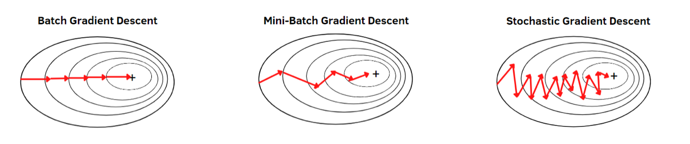

---

## Overfitting and underfitting

__Overfitting__: too complex model, does not generalize to new data.

__Underfitting__: too simple model, does not capture the data structure.

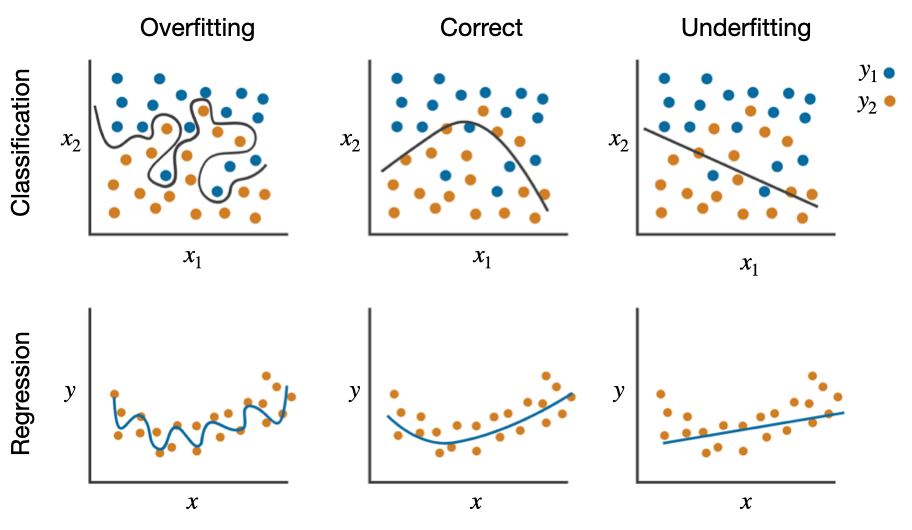

---

## Splitting the dataset into train and test sets

The __training set__ is used to train the model. The __test set__ is used to evaluate the model generalization error on unseen data.

> The typical split is 80% for the training set and 20% for the test set.

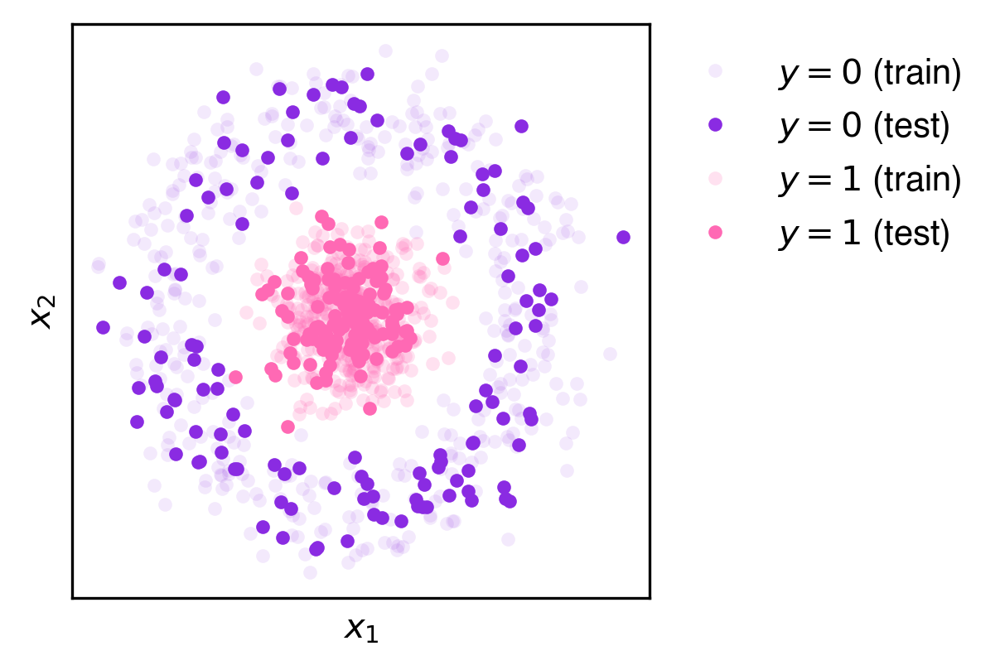

---

## Training and test learning curves

We must ensure that both the training and test losses decrease. If the training loss is much lower than the test loss, the model __overfits__ the training set.

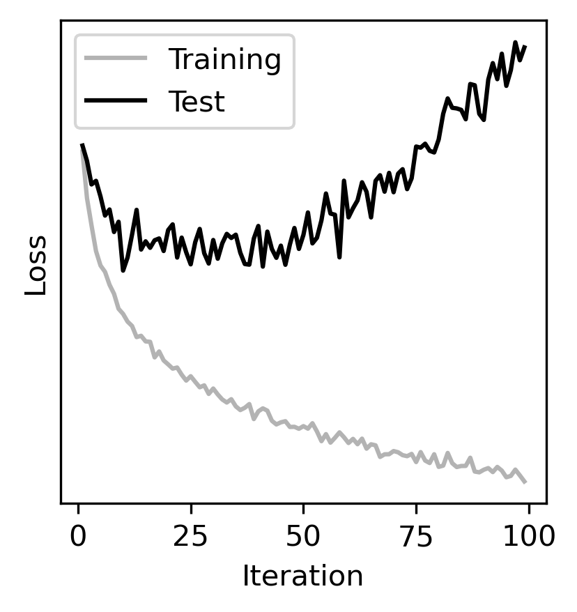

---

## Targetting the right model complexity

The __model complexity__ is roughly the number of parameters of the model. The __model generalization error__ is the error on the test set.

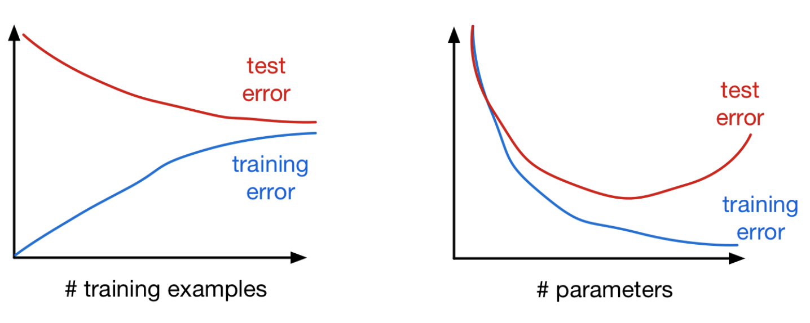

---

## Regularization

__Regularization__ is a technique to control overfitting by adding a penalty term $\mathcal{R}$ to the loss function. The __regularization parameter__ $\lambda$ controls the strength of the regularization.

$$
\mathcal{L}_\mathrm{reg} = \mathcal{L} + \lambda \mathcal{R} = \mathcal{L} + \lambda \|\mathbf{\theta}\|^2_2
$$

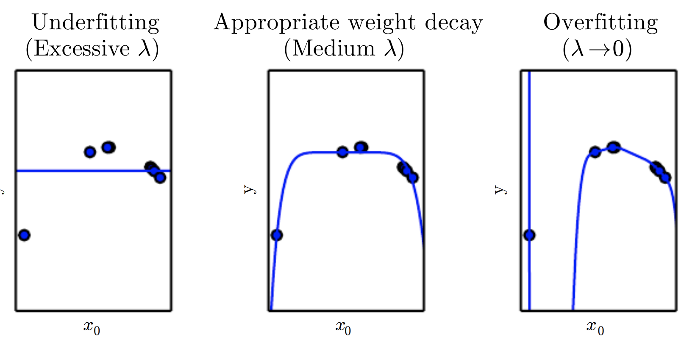

<!-- _footer: From Goodfellow et al. (2016) -->

---

## A fully connected network for solving the MNIST classification

<!-- _footer: LeCun et al. (1998) -->

Handwritten digits set of grayscale images $x \in \mathbb{R}^{28 \times 28}$ and classes $y \in \{0, \dots, 9\}$. 
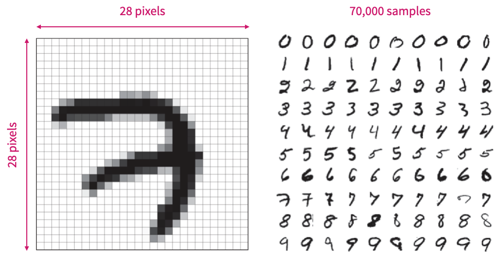
__Goal__: predict the number encoded in the pixels.

---

<!-- _class: dark -->
<!-- _footer: adamharley.com (Harley, 2015) -->

## A fully connected network for solving the MNIST classification

<iframe src="https://adamharley.com/nn_vis/mlp/3d.html" width="1280" height="630" frameborder="0" allowfullscreen style="position:fixed;bottom:0;zoom:100%;"></iframe>

---

## Example in seismology: fully-connected autoencoder

<!-- _footer: from Valentine and Trampert (2012) -->

Training of a fully-connected autoencoder on real seismic data. 

This is an __unsupervised__ learning task: the input and output are the same.

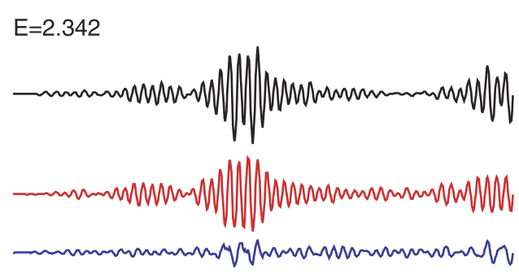

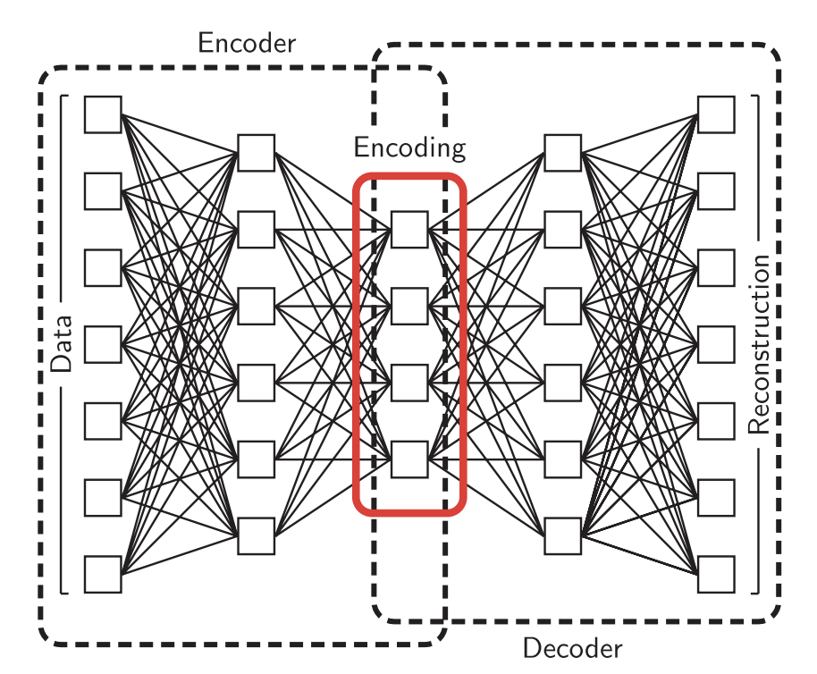

---

## Example in seismology: fully-connected autoencoder

<!-- _footer: from Valentine and Trampert (2012) -->

We __learned__ a low-dimensional representation for the seismic data.

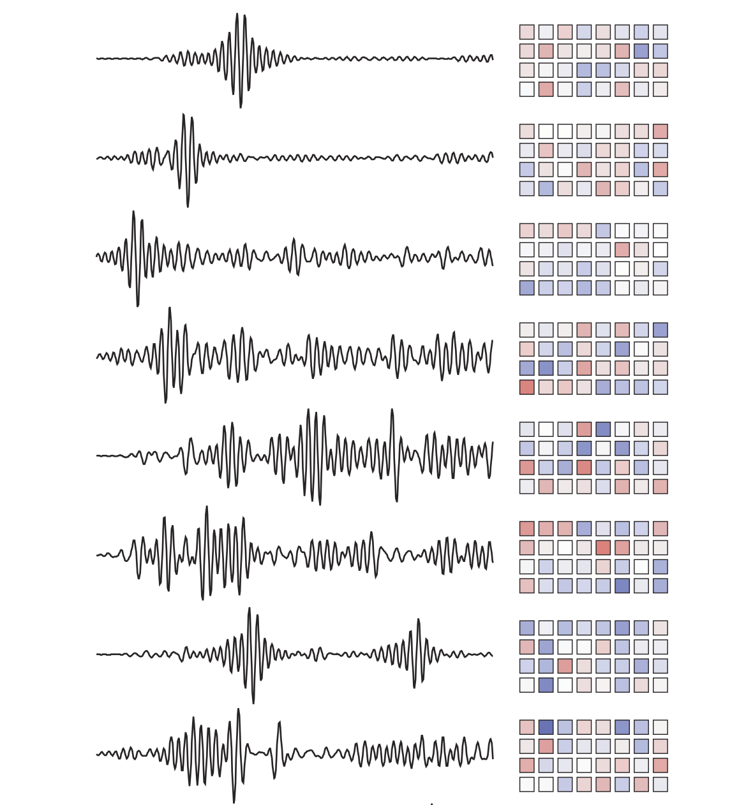

These are the __latent variables__ of the autoencoder.

---

## Example in seismology: fully-connected autoencoder

<!-- _footer: from Valentine and Trampert (2012) -->

Example applications:
- quality assessment
- compression

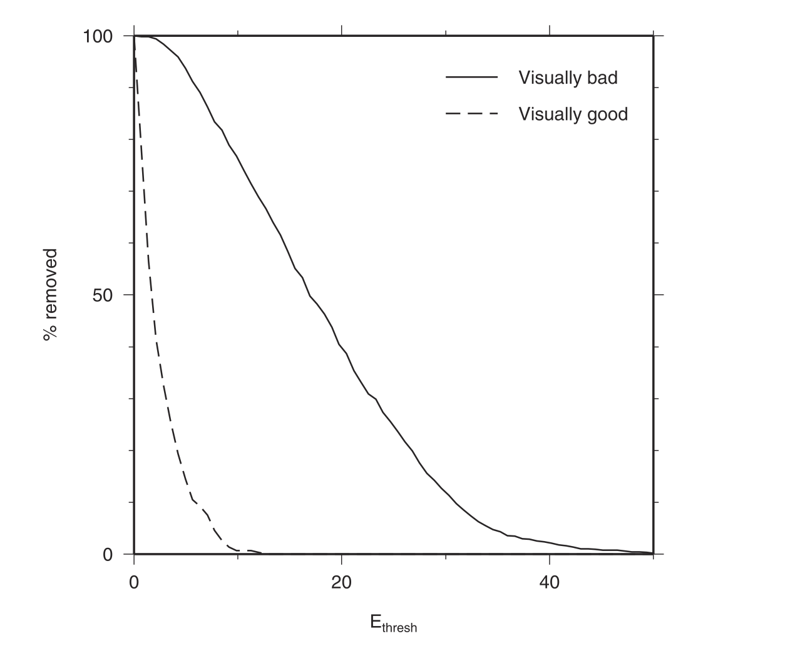

---

<!-- _class: titlepage-->

# 6. Deep learning: convolutional neural networks

How deep learning works? What is a neural network? How to train it, and what for?

---

## Limitations of fully connected networks

Vision is robust to a lot:

- Translation
- Rotation
- Scaling
- Shearing
- Illumination
- Occlusion

We need invariance to these transformations.

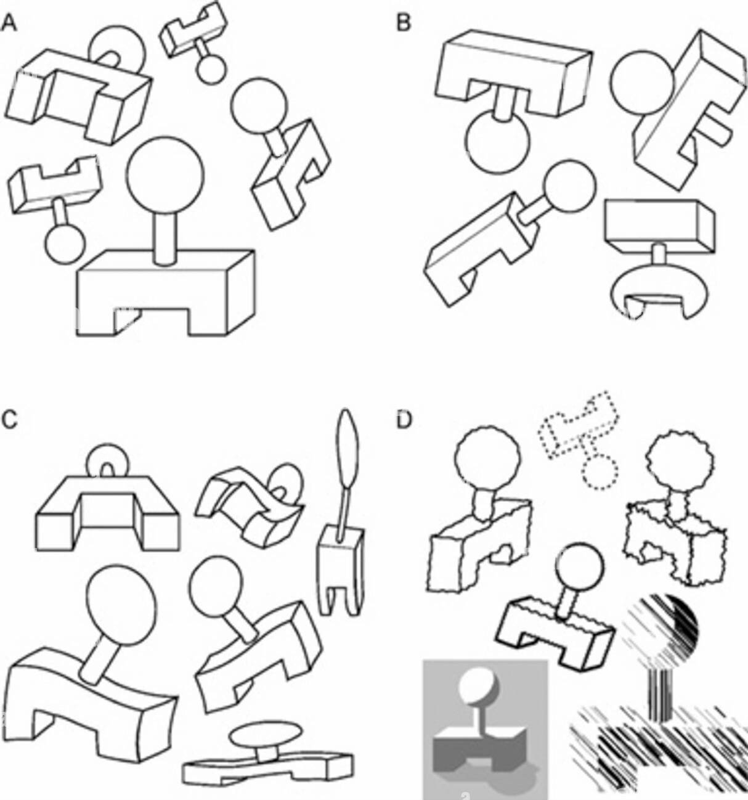

---

## Example: the handwritten digits

<!-- _footer: LeCun et _al._ (1998) -->

Handwritten digits set of grayscale images $x \in \mathbb{R}^{28 \times 28}$ and classes $y \in \{0, \dots, 9\}$.  

---

## Limitations of fully connected networks

An image may be of $200 \times 200$ pixels $\times 3$ color channels. With a __fully connected network__ with $1000$ hidden units, we would have $N = 200 \times 200 \times 3 \times 1000 = 120$M parameters.   __This clearly does not scale to large images.__

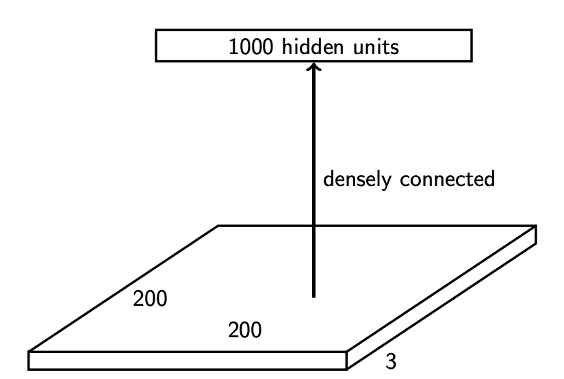

---

## Convolutional neural networks

__Convolutional layers__ are a type of layer that are used in convolutional neural networks. They are composed of a set of learnable filters.

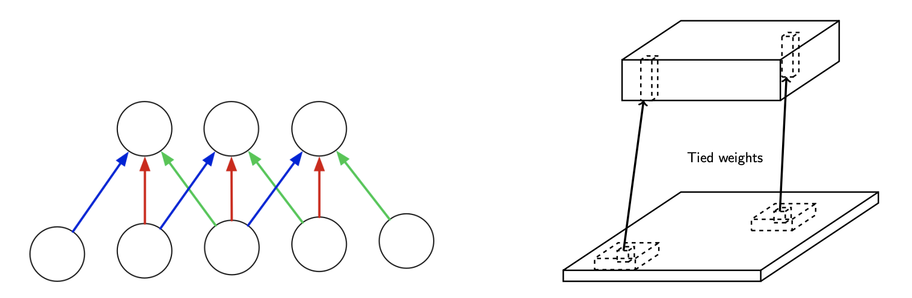

Each hidden unit look a local content from the input image, althought the weights are shared across the entire image.

---

## Convolutional neural networks

Discrete image convolution:

$$ (A * B)_{ij} = \sum_n \sum_m A_{nm}B_{i-n, j-m} $$

where $A$ is a input image, and $B$ is a convolutional kernel (weights) to learn.

> Convolutional layers extract local features from the input image ≠ fully connected layers that extract global features.

<!-- _footer: From Vincent Dumoulin, Francesco Visin (2016) -->

---

## Convolution operation

$$(A * B)_{ij} = \sum_n \sum_m A_{nm}B_{i-n, j-m}$$
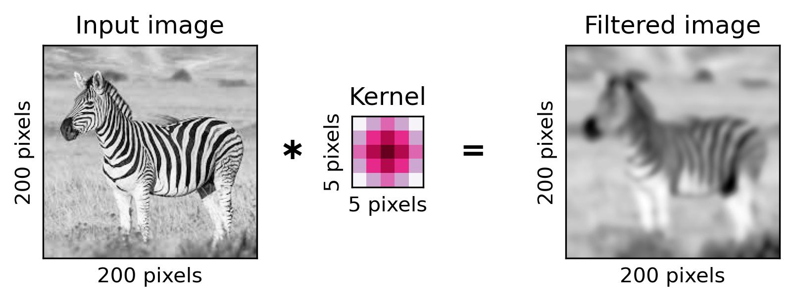

---

## Convolution operation

$$(A * B)_{ij} = \sum_n \sum_m A_{nm}B_{i-n, j-m}$$
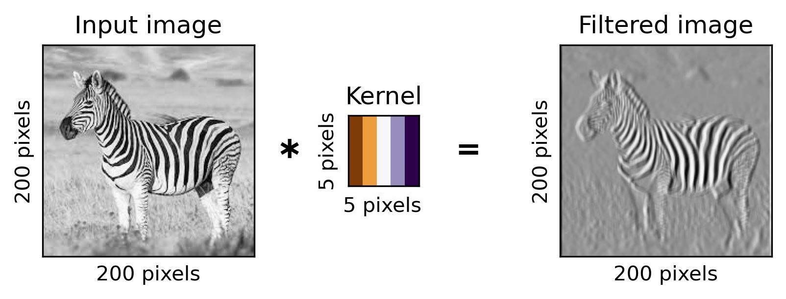

---

## Convolution unit

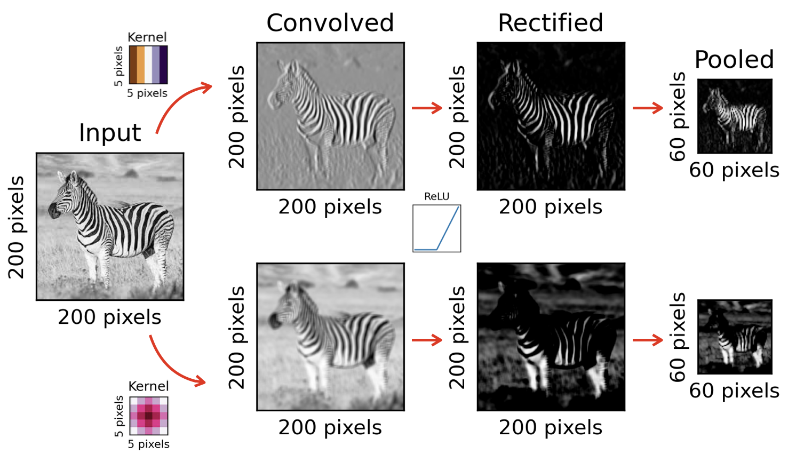

---

## Convolutional neural network: example with VGG16

Now, we can understand this winning architecture for image classification. 
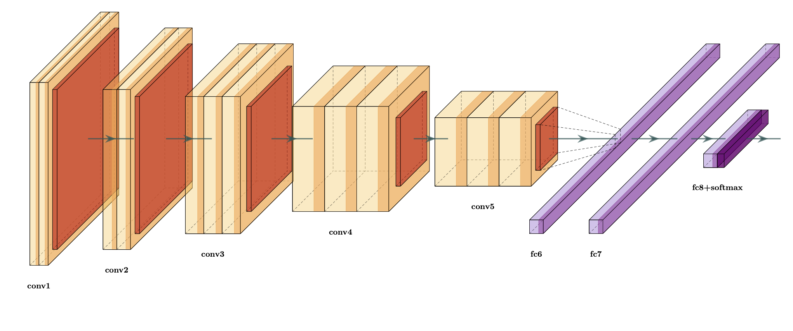
Note the last three layers are __fully connected__.
When extracting low-dimensional data from images, this is often needed.

---

## Convolutional neural network: example with VGG16

<!-- _footer: from Zeiler and Fergus (2013) -->

Here are the __filters from the first layer__ of VGG16 after training on 100k+ images. These filters collect various shapes, scales, colors, etc.

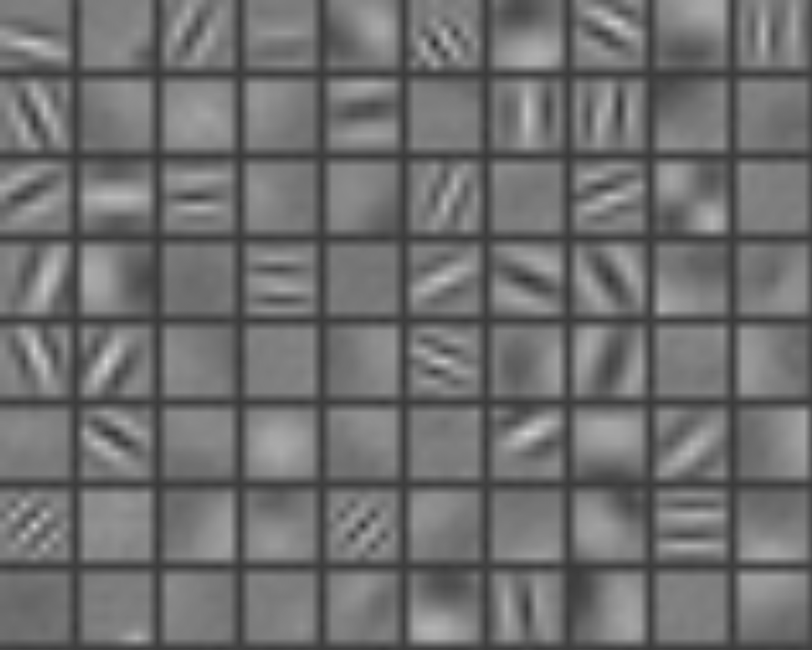

---

<!-- _class: dark -->
<!-- _footer: adamharley.com (Harley, 2015) -->

## A convolutional network for solving the MNIST classification

<iframe src="https://adamharley.com/nn_vis/cnn/3d.html" width="1280" height="630" frameborder="0" allowfullscreen style="position:fixed;bottom:0;zoom:100%;"></iframe>

---

<!-- _class: titlepage-->

# 7. Applications

The illustration of the previous concepts with examples from seismology. And then you will be ready to apply these concepts to your own problems!

---

## Deep-learning applications in seismology

- Signal detection, pattern recognition
- Classification
- Source localization from sparse or evolving datasets
- Denoising and compression

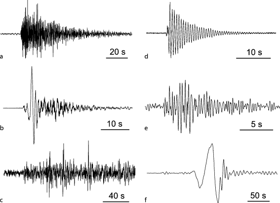

---

## Earthquake detection and location with ConvNetQuake

__Features__: 3-comp. waveform $x \in \mathbb{R}^{N \times 3}$
__Target__: prob. of event in cell $1$ to $6$
__Loss__: cross-entropy with regularization $\mathcal{L} = - \sum_c q_c \log p_c + \lambda \| \mathbf{w}\|^2_2$ 
 

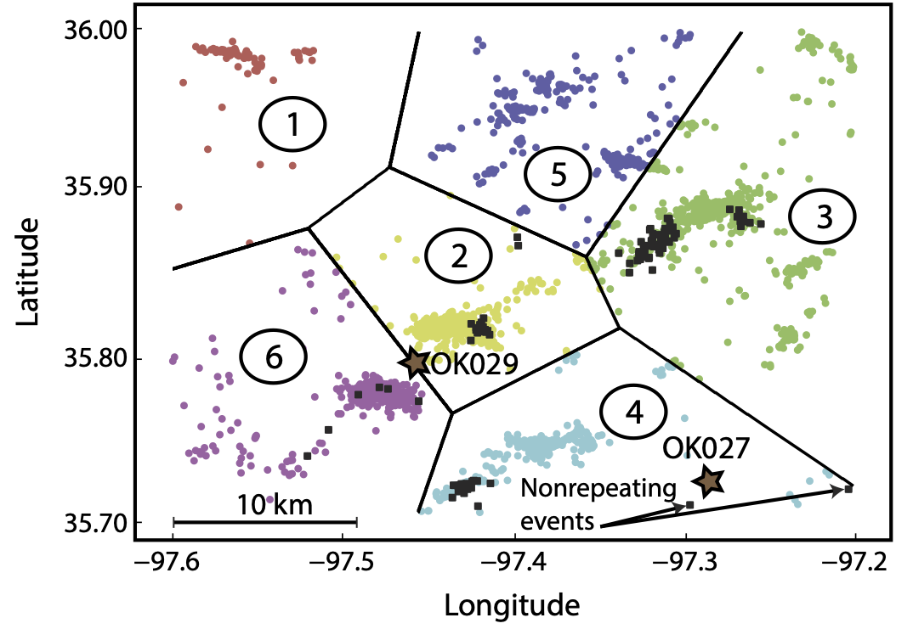

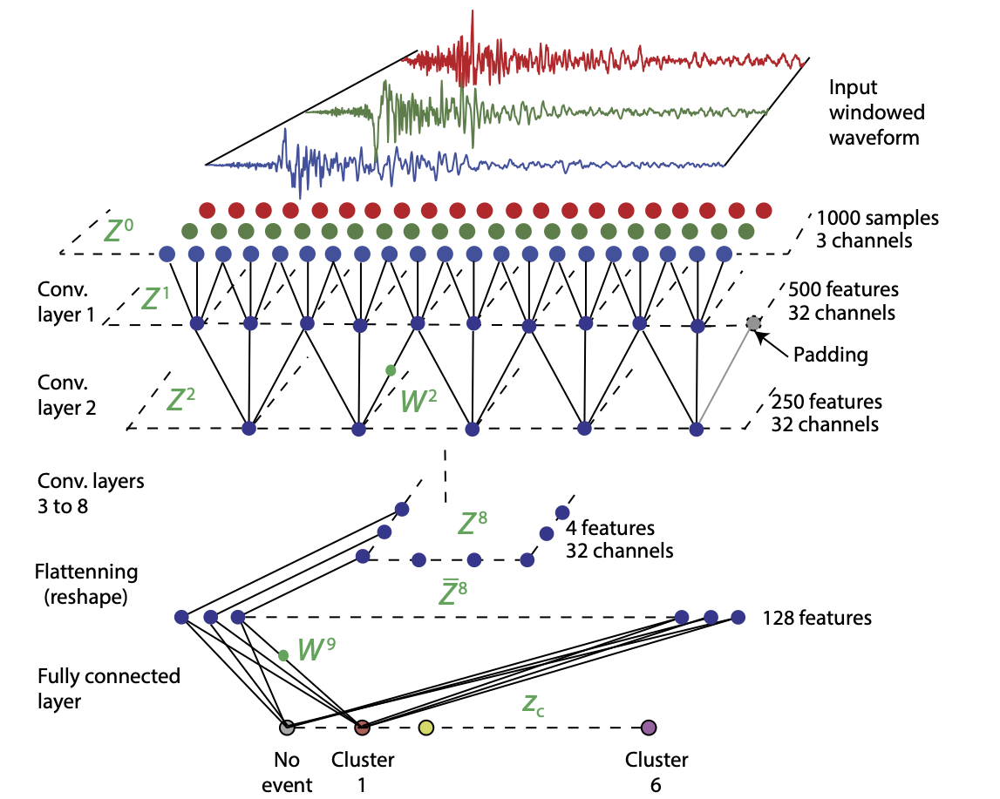

<!-- _footer: From Perol et al. (2016) -->

---

## Seismic phase picking with PhaseNet

__Features__: 3-component seismic signal $x \in \mathbb{R}^{3000 \times 3}$. 

  

__Targets__: probabilities $p_i(x)$ of $P$, $S$, and $N$oise over time $= y \in \mathbb{R}^{3000 \times 3}$

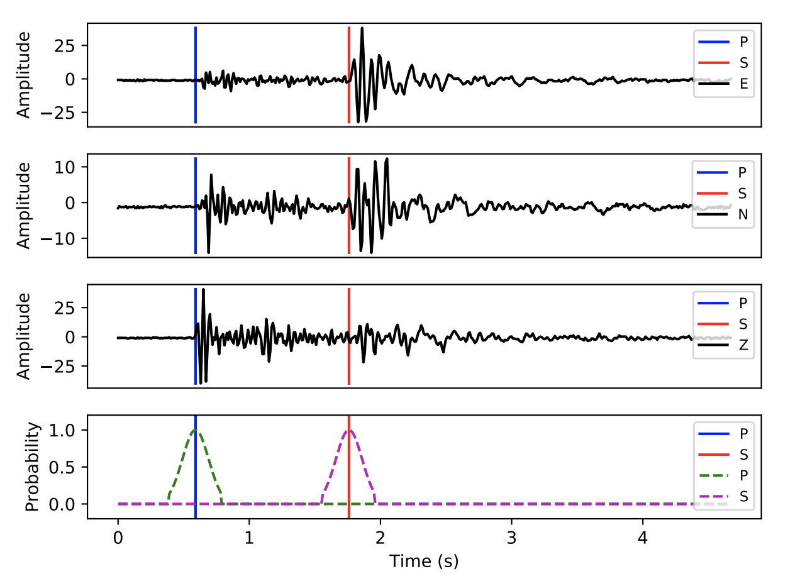

<!-- _footer: From Zhu et al. (2016) -->

---

## Seismic phase picking with PhaseNet

__Features__: 3-component seismic signal $x \in \mathbb{R}^{3000 \times 3}$
__Targets__: probabilities $p_i(x)$ of $P$, $S$, and $N$oise over time $= y \in \mathbb{R}^{3000 \times 3}$
__Loss__: cross-entropy $\mathcal{L} = -\sum_i\sum_x p(x)\log(q(x))$ 
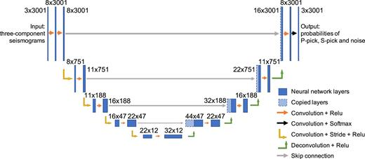

<!-- _footer: From Zhu et al. (2016) -->

---

## Seismic phase picking with PhaseNet

__Features__: 3-component seismic signal $x \in \mathbb{R}^{3000 \times 3}$
__Predictions__: likelihood $q_i(x)$ of $P$, $S$, and $N$oise over time 
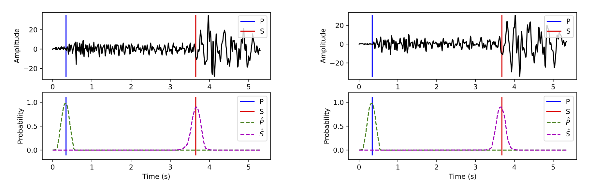

<!-- _footer: From Zhu et al. (2016) -->

---

## Seismic phase picking with PhaseNet

__Features__: 3-component seismic signal $x \in \mathbb{R}^{3000 \times 3}$
__Predictions__: likelihood $q_i(x)$ of $P$, $S$, and $N$oise over time 
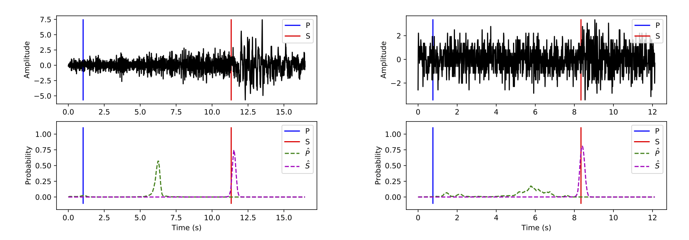

<!-- _footer: From Zhu et al. (2016) -->

---

## Transfer learning and fine-tuning

__Transfer learning__ is the use of a pre-trained model $f_\alpha = f_{\theta^*}$ on a new task as a initial point for training a new model $f_\alpha \rightarrow f_{\alpha^*}$.

__Fine-tuning__ is the partial re-training of a pre-trained model on a new task, while keeping the weights of the pre-trained layers fixed.

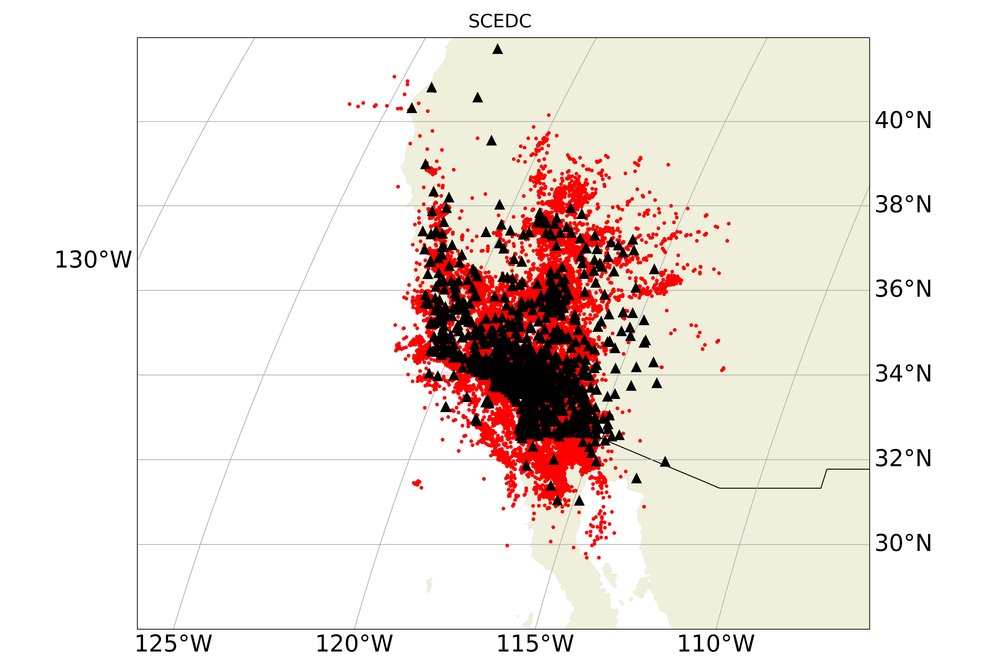

---

## Deep-learning libraries in Julia and Python

### Warning

Libraries are constantly evolving, and the documentation is often incomplete.

 

 

 

 

 

---

## Dive into the scikit-learn toolbox documentation

<!-- _footer: Online documentation at [scikit-learn.org](https://scikit-learn.org/stable) -->

### Scikit-Learn toolbox documentation

- Machine learning in Python
- Online examples
- Explanation of algorithms
- Grey-box models

<iframe src="https://scikit-learn.org/stable/" width="700px" height="520px" style="border: none; box-shadow: 0px 0px 20px #ccc; border-radius: 5px;zoom:1"></iframe>

---

## Learning visually with the TensorFlow playground

<iframe src="https://playground.tensorflow.org/" width="1280px" height="849px" style="zoom: 1; border: none; top: -130px; left: 0px; position: absolute; z-index: -10;"></iframe>

<!-- _footer: https://playground.tensorflow.org -->

---

## Interesting online projects

<iframe src="https://quickdraw.withgoogle.com/data" width="1280px" height="650px" style="zoom: 1; border: none; margin-top: -130px !important;"></iframe>

<!-- _footer: https://quickdraw.withgoogle.com/data -->

---

<!-- _class: titlepage -->

# 8. Unsupervised learning

---

## Main types of machine learning

Predict some output $\mathbf{y}$ from input $\mathbf{x}$ (regression, classification).

Learn data distribution $p(\mathbf{x})$ or structure (clustering, reduction).

Learns a policy to maximize the reward (game playing, robotics).

<!-- _footer: from [mathworks.com](https://nl.mathworks.com/discovery/reinforcement-learning.html) -->

---

## Contents of this class make use of the scikit-learn library

<!-- _footer:  [www.scikit-learn.org](https://scikit-learn.org/stable/) -->

---

<!-- _footer: from [researchgate.net](https://www.researchgate.net/publication/351953193_Supervised_and_unsupervised_machine_learning_a_Schematic_representation_of_an_artificial_neural_network) -->

## Unsupervised learning: learning the structure of the data without labels

__Clustering__

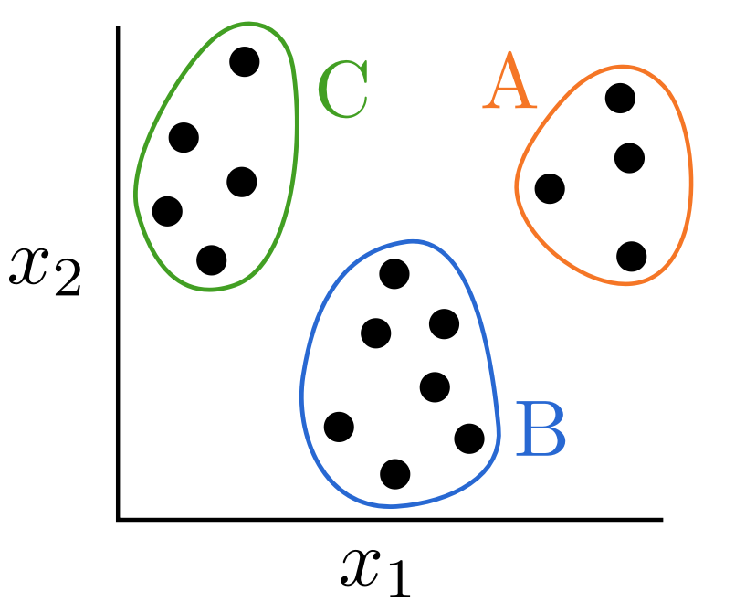

Group similar data points together based on some similarity measure.

__Dimensionality reduction__

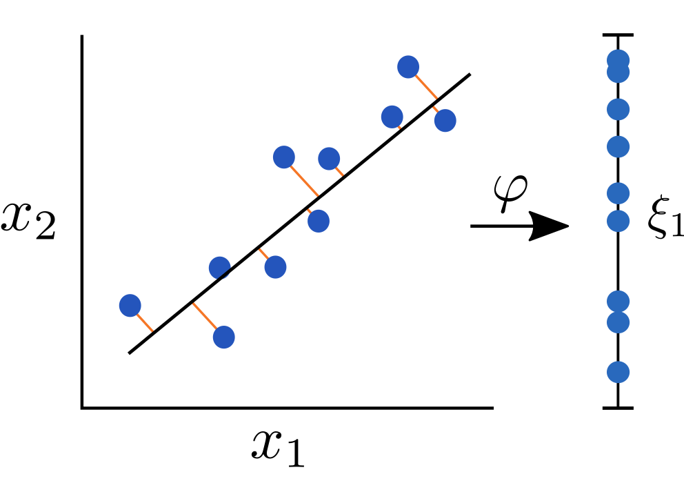

Find a low-dimensional representation of the data.

--- 

## Clustering – class-membership identification without labels

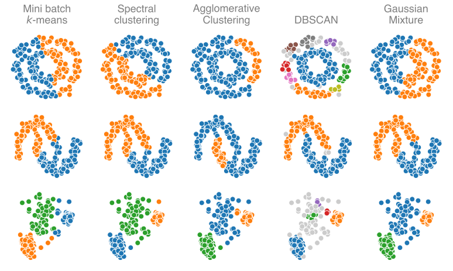

<!-- _footer: from [scikit-learn.org](https://scikit-learn.org/stable/auto_examples/cluster/plot_cluster_comparison.html) -->

---

## Definitions of clustering

Two main definitions of clustering:

- Top-bottom: partition the heterogeneous data into __homogeneous__ subsets.

- Bottom-up: group the data samples based on some criterion of __similarity__.

`->` We need to provide a definition of __similarity__ or __homogeneity__.

---

## Example of clustering with _k_-means

$k$-means is a clustering algorithm that partitions the data into $k$ clusters by minimizing the __inertia__:

$$
\arg\min_{\mathbf{C}} \sum_{i=1}^{k} \sum_{\mathbf{x}_j \in C_i} \|\mathbf{x}_j - \mu_i\|^2
$$

where $\mu_i$ is the centroid of cluster $C_i$.

--- 

## Example of clustering with _k_-means

In practice, we need to provide the number of clusters $k$, and the algorithm will find the best partition:

1. Initialize the centroids $\mu_i$ randomly.
2. Assign each sample to the closest centroid.
3. Update the centroids with the new samples.
4. Repeat until convergence.

<!-- _footer: Wikipedia -->

---

## Example of clustering with spectral clustering

Spectral clustering uses the eigenvectors of the similarity matrix to find the clusters. 

1. Compute the adjacency matrix.
2. Compute the Laplacian matrix. 
3. Get the first $m$ eigenvectors.
4. Cluster the data using $k$-means.

---

<!-- _footer: from [researchgate.net](https://www.researchgate.net/publication/351953193_Supervised_and_unsupervised_machine_learning_a_Schematic_representation_of_an_artificial_neural_network) -->

## Unsupervised learning: learning the structure of the data without labels

__Clustering__

Group similar data points together based on some similarity measure.

__Dimensionality reduction__

Find a low-dimensional representation of the data.

---

## Eigenvectors of a matrix

The eigenvectors of a matrix are obtained by solving the eigenvalue problem:

$$
\mathbf{A}\mathbf{x} = \lambda \mathbf{x}
$$

where $\mathbf{A}$ is a square matrix, $\mathbf{x}$ is the eigenvector, and $\lambda$ is the eigenvalue.

---

## Singular value decomposition

The singular value decomposition (SVD) of a matrix $\mathbf{A}$ is defined as:
$$
\mathbf{A} = \mathbf{U}\mathbf{\Sigma}\mathbf{V}^T
$$
where $\mathbf{U}$ and $\mathbf{V}$ are orthogonal matrices, and $\mathbf{\Sigma}$ is a diagonal matrix.

---

## Example of dimensionality reduction with principal component analysis

Principal component analysis (PCA) is a dimensionality reduction technique that uses eigendecomposition:

1. Compute the data covariance matrix.
2. Compute the eigenvectors.
3. Project the data onto the eigenvectors.

<!-- _footer: Wikipedia -->

---

## Example of dimensionality reduction with independent component analysis

Independent component analysis (ICA) is a dimensionality reduction technique that maximizes the independence of the components.

---

## Principal vs. independent component analysis

For blind source separation, ICA is preferred over PCA.

---

## Kernel PCA, of course

Kernel PCA is a non-linear dimensionality reduction technique that uses the kernel trick to project the data onto a higher-dimensional space.

---

## Deep unsupervised learning

Deep neural networks can be used for unsupervised learning:
__Autoencoders__: learn a low-dimensional representation of the data.
__Generative adversarial networks__: learn a generative model of the data.

---

## Autoencoders

Autoencoders are neural networks that learn a low-dimensional representation of the data. They are composed of an __encoder__ and a __decoder__.

The input $\mathbf{x}$ is encoded into a latent representation $\mathbf{z}$, and decoded into $\mathbf{x}'$.

The loss function is the difference between the input and the reconstruction: 

$$
\mathcal{L} = \|\mathbf{x} - \mathbf{x}'\|^2
$$

---

## Convolutional autoencoders

Convolutional autoencoders use convolutional layers instead of fully connected layers.
They are used for image denoising, compression, and quality assessment.

---

<!-- _class: titlepage-->

# _The end!_

